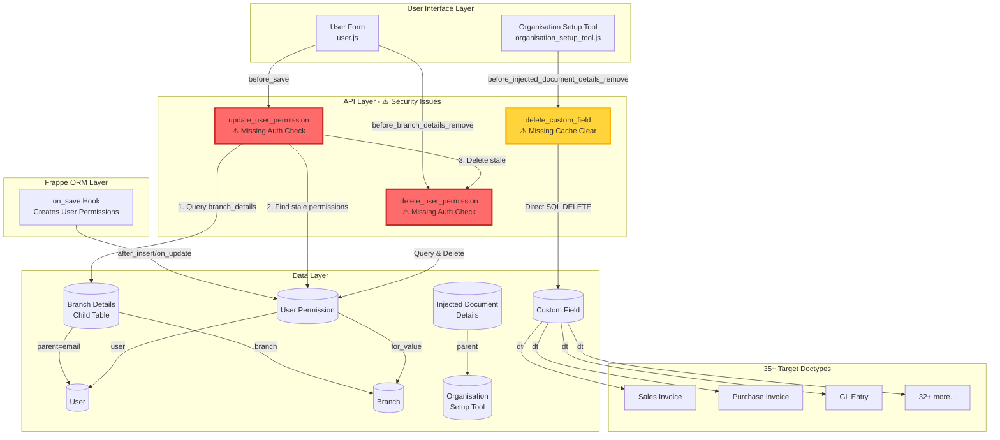
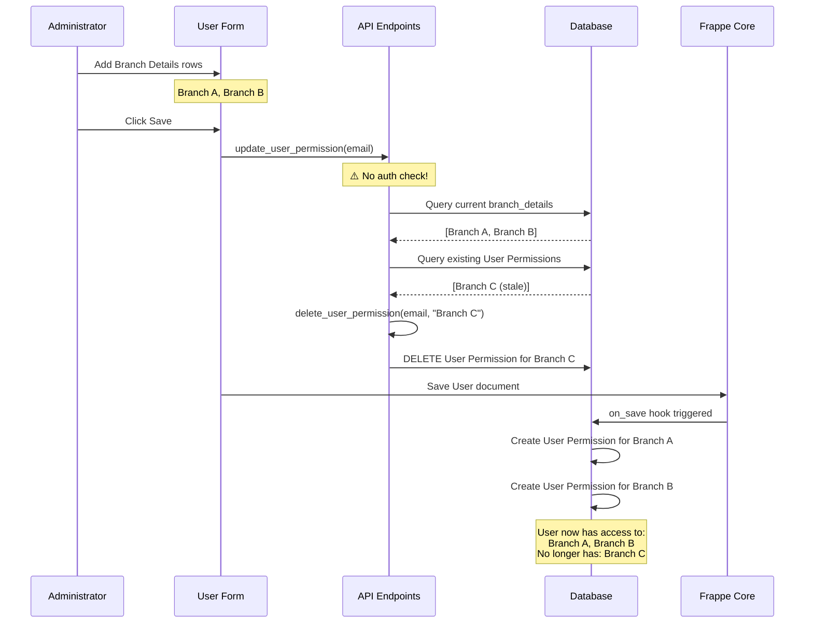
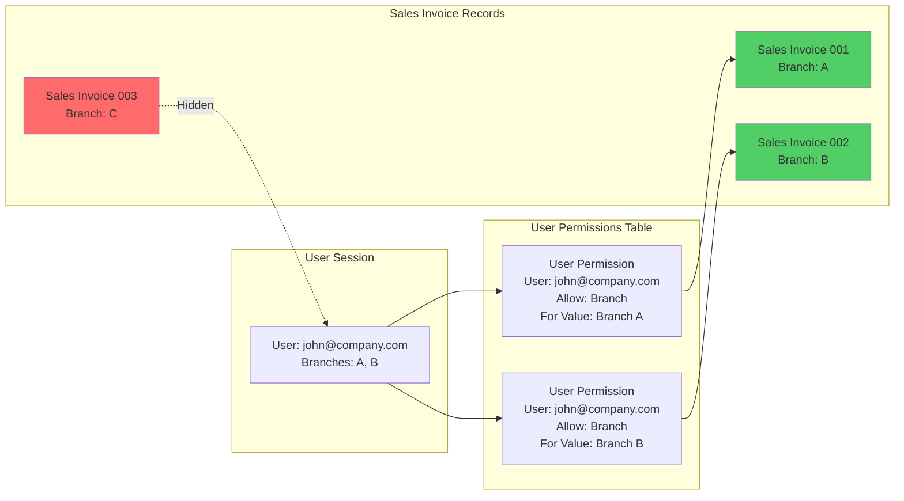
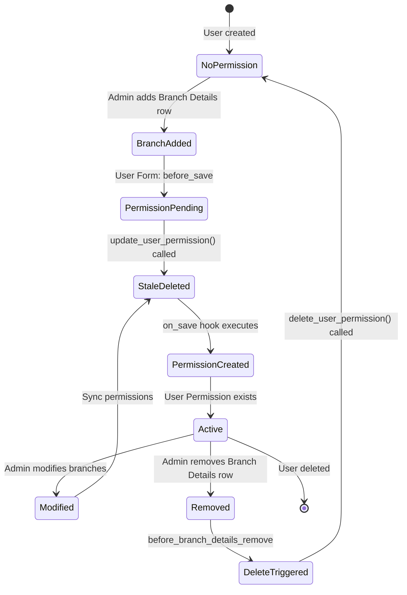
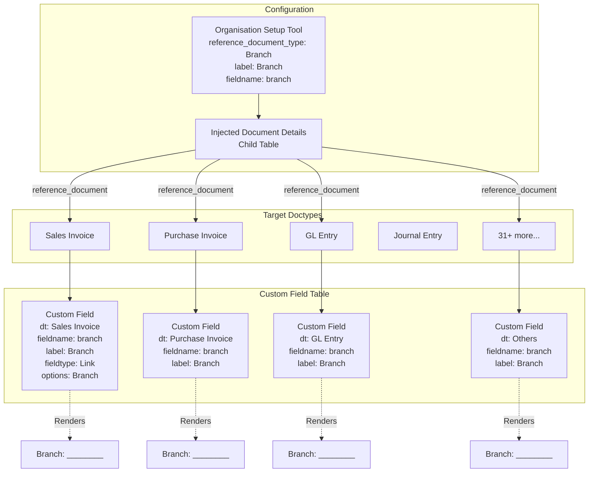

# erpnext_org_structure - API Endpoint Specification

## Application Overview

- **Application Name:** erpnext_org_structure
- **Purpose:** Branch-based multi-tenancy and organization structure management for ERPNext
- **Total API Endpoints:** 3
- **Primary Use:** User permission management and custom field injection
- **Security Status:** ⚠️ Critical authorization vulnerabilities present

### Application Architecture

The erpnext_org_structure application provides branch-based multi-tenancy capabilities by:
- Extending the User doctype with branch assignments
- Automatically managing User Permission records for branch-level data isolation
- Dynamically injecting custom fields into 35+ ERPNext doctypes
- Overriding accounting period validation to support branch-specific accounting

---

## Security Summary

### Critical Security Issues Found

| Severity | Issue | Affected Endpoints | Impact | CVSS Score |
|----------|-------|-------------------|---------|------------|
| **HIGH** | Missing authorization validation | delete_user_permission(), update_user_permission() | Any authenticated user can modify any user's branch permissions, leading to privilege escalation and unauthorized data access | 8.1 |
| **MEDIUM** | Missing input validation | delete_user_permission(), update_user_permission() | No validation of email format, user existence, or branch existence. Can cause database errors or silent failures | 5.3 |
| **MEDIUM** | Missing cache invalidation | delete_custom_field() | Direct SQL DELETE bypasses Frappe ORM cache management, leading to stale metadata and potential form rendering issues | 4.7 |
| **LOW** | SQL injection potential | delete_custom_field() | Uses parameterized queries but lacks input sanitization. Parameters come from trusted doctype fields | 3.1 |

### Attack Scenarios

**Scenario 1: Privilege Escalation via Permission Manipulation**
```python
# Attacker with basic user access executes:
frappe.call('erpnext_org_structure.erpnext_org_structure.doctype.user.user.delete_user_permission',
    args={'user': 'admin@company.com', 'branch': 'Headquarters'})

# Result: Admin loses access to Headquarters branch data
# Impact: Denial of service, unauthorized access control modification
```

**Scenario 2: Unauthorized Branch Access Grant**
```python
# Attacker grants themselves access to restricted branches:
# 1. Use browser console to add branch_details row for restricted branch
# 2. Save triggers update_user_permission() without authorization check
# 3. Attacker gains User Permission for restricted branch
# 4. Can now view/modify data restricted to that branch
```

---

## API Endpoint Inventory

| Endpoint | Method | File Location | Line Numbers | Called By | Security Status |
|----------|--------|---------------|--------------|-----------|----------------|
| delete_user_permission | POST | /erpnext_org_structure/erpnext_org_structure/doctype/user/user.py | 23-27 | User form (before_branch_details_remove), update_user_permission() | ⚠️ Critical |
| update_user_permission | POST | /erpnext_org_structure/erpnext_org_structure/doctype/user/user.py | 29-37 | User form (before_save) | ⚠️ Critical |
| delete_custom_field | POST | /erpnext_org_structure/erpnext_org_structure/doctype/organisation_setup_tool/organisation_setup_tool.py | 76-79 | Organisation Setup Tool form (before_injected_document_details_remove) | ⚠️ Medium |

---

## Detailed Endpoint Specifications

### 1. delete_user_permission

**⚠️ CRITICAL SECURITY ISSUE: Missing Authorization Check**

#### Endpoint Information

- **Function Name:** `delete_user_permission`
- **File Location:** `/home/rajit/git/RanagSutra_base/frappe-bench/apps/erpnext_org_structure/erpnext_org_structure/erpnext_org_structure/doctype/user/user.py`
- **Line Numbers:** 23-27
- **Decorator:** `@frappe.whitelist()`
- **Access Level:** Any authenticated user
- **Purpose:** Remove branch access from a user by deleting their User Permission record

#### Source Code

```python
@frappe.whitelist()
def delete_user_permission(user,branch):
	name=frappe.db.get_value("User Permission",{'user':user,'allow':'Branch','for_value':branch},'name')
	if name:
		frappe.delete_doc("User Permission",name)
```

#### Parameters

| Parameter | Type | Required | Description | Validation |
|-----------|------|----------|-------------|------------|
| user | String | Yes | Email address of the target user | ❌ None - no email format check, no user existence validation |
| branch | String | Yes | Name of the Branch to revoke access from | ❌ None - no branch existence validation |

#### Request Example

```javascript
// Called from User form when removing a branch
frappe.call({
    method: "erpnext_org_structure.erpnext_org_structure.doctype.user.user.delete_user_permission",
    args: {
        user: "john.doe@company.com",
        branch: "Branch A"
    },
    async: false,
    callback: function(r) {
        // No response handling
    }
});
```

#### Response

**Success:** No return value (implicit `None`)

**Failure Scenarios:**
- User Permission record not found: Silent failure, no error thrown
- Invalid user email: Silent failure, query returns nothing
- Invalid branch name: Silent failure, query returns nothing
- User lacks permission to delete User Permission doctype: Frappe permission error

#### Behavior Flow

1. Query User Permission table for matching record (user + Branch + branch value)
2. If record exists, delete the User Permission document
3. Frappe framework sends delete event hooks
4. User loses access to the specified branch across all doctypes

#### Security Analysis

**Current Implementation Flaws:**

1. **No Authorization Check:** Any authenticated user can delete any user's branch permissions
   - No validation that `frappe.session.user` has authority to modify target user
   - No role-based access control (RBAC) enforcement
   - No check for "User Permission Manager" role or equivalent

2. **No Input Validation:**
   - Email format not validated
   - User existence not checked before querying
   - Branch existence not verified
   - Could lead to silent failures or misleading behavior

3. **No Audit Trail:**
   - No logging of who deleted whose permissions
   - No comment or reason field required
   - Difficult to trace permission changes

4. **Bypasses Frappe Permission System:**
   - Uses `frappe.delete_doc()` which checks permissions on User Permission doctype
   - However, most users shouldn't have write access to User Permission
   - The `@frappe.whitelist()` decorator bypasses normal permission checks

**Attack Vectors:**

1. **Privilege Escalation:** Malicious user removes admin's branch access
2. **Denial of Service:** Mass deletion of user permissions
3. **Data Access Manipulation:** Remove permissions then re-add with different settings

#### Recommended Fix

```python
@frappe.whitelist()
def delete_user_permission(user, branch):
    # Authorization check: Only allow if user is modifying their own permissions
    # OR has System Manager role OR has write permission on User Permission doctype
    if frappe.session.user != user and \
       not frappe.has_permission("User Permission", "write") and \
       "System Manager" not in frappe.get_roles():
        frappe.throw("Not authorized to modify user permissions", frappe.PermissionError)

    # Input validation
    if not frappe.db.exists("User", user):
        frappe.throw(f"User {user} does not exist")

    if not frappe.db.exists("Branch", branch):
        frappe.throw(f"Branch {branch} does not exist")

    # Validate email format
    import re
    email_regex = r'^[a-zA-Z0-9._%+-]+@[a-zA-Z0-9.-]+\.[a-zA-Z]{2,}$'
    if not re.match(email_regex, user):
        frappe.throw(f"Invalid email format: {user}")

    # Proceed with deletion
    name = frappe.db.get_value("User Permission", {
        'user': user,
        'allow': 'Branch',
        'for_value': branch
    }, 'name')

    if name:
        frappe.delete_doc("User Permission", name)
        frappe.msgprint(f"Branch permission for {branch} removed from user {user}")
    else:
        frappe.msgprint(f"No permission found for user {user} and branch {branch}")
```

#### Integration Points

**Called By:**
1. **User Form (JavaScript)** - `/erpnext_org_structure/erpnext_org_structure/doctype/user/user.js` (Lines 28-40)
   - Event: `before_branch_details_remove` on Branch Details child table
   - Synchronous call (async: false)
   - Triggered when user removes a row from branch_details table

2. **update_user_permission()** - Same file, line 37
   - Called internally when syncing permissions
   - Removes permissions for branches no longer in branch_details

**Dependencies:**
- Frappe User Permission doctype
- Branch doctype
- User doctype

---

### 2. update_user_permission

**⚠️ CRITICAL SECURITY ISSUE: Missing Authorization Check**

#### Endpoint Information

- **Function Name:** `update_user_permission`
- **File Location:** `/home/rajit/git/RanagSutra_base/frappe-bench/apps/erpnext_org_structure/erpnext_org_structure/erpnext_org_structure/doctype/user/user.py`
- **Line Numbers:** 29-37
- **Decorator:** `@frappe.whitelist()`
- **Access Level:** Any authenticated user
- **Purpose:** Synchronize User Permission records with current Branch Details assignments

#### Source Code

```python
@frappe.whitelist()
def update_user_permission(email):
	branches = []
	for doc_name in frappe.db.get_list("Branch Details",{'parent':email,'parenttype':'User'},'branch'):
		if doc_name:
			branches.append(doc_name.branch)
	if branches:
		for user_perm in frappe.db.get_list("User Permission",{'user':email,'allow':'Branch','for_value':('not in',branches)},'for_value'):
			delete_user_permission(email,user_perm.for_value)
```

#### Parameters

| Parameter | Type | Required | Description | Validation |
|-----------|------|----------|-------------|------------|
| email | String | Yes | Email address of the user whose permissions need syncing | ❌ None - no validation |

#### Request Example

```javascript
// Called from User form before save
frappe.call({
    method: "erpnext_org_structure.erpnext_org_structure.doctype.user.user.update_user_permission",
    args: {
        email: frm.doc.email
    },
    async: false,
    callback: function(r) {
        // No response handling
    }
});
```

#### Response

**Success:** No return value (implicit `None`)

**Failure:** Silent failures on invalid email or missing branch details

#### Behavior Flow

1. Query all Branch Details child records for the given user email
2. Build list of currently assigned branches
3. Query all existing User Permission records for that user (type: Branch)
4. For each User Permission where branch is NOT in current branch_details list:
   - Call `delete_user_permission()` to remove it
5. Does NOT create new User Permission records (handled by `on_save` hook)

#### Security Analysis

**Current Implementation Flaws:**

1. **No Authorization Check:** Any authenticated user can sync any user's permissions
   - No validation that caller has authority to modify target user
   - No role-based access control
   - Bypasses normal Frappe permission system

2. **No Input Validation:**
   - Email not validated for format or existence
   - No check that user has Branch Details
   - Silent failure if email doesn't exist

3. **Incomplete Synchronization:**
   - Only DELETES stale permissions
   - Does NOT create new permissions (relies on `on_save` hook)
   - Creates temporal vulnerability if called outside normal save flow

4. **Race Condition Risk:**
   - Reads branch_details from database
   - In before_save hook, branch_details may not be committed yet
   - Could delete permissions that should remain

**Attack Vectors:**

1. **Permission Manipulation:** Attacker calls with any user's email to delete their branch permissions
2. **Denial of Service:** Repeatedly call to trigger unnecessary database queries
3. **Data Corruption:** Call with invalid email causes silent database inconsistencies

#### Recommended Fix

```python
@frappe.whitelist()
def update_user_permission(email):
    # Authorization check
    if frappe.session.user != email and \
       not frappe.has_permission("User Permission", "write") and \
       "System Manager" not in frappe.get_roles():
        frappe.throw("Not authorized to modify user permissions", frappe.PermissionError)

    # Input validation
    if not frappe.db.exists("User", email):
        frappe.throw(f"User {email} does not exist")

    # Validate email format
    import re
    email_regex = r'^[a-zA-Z0-9._%+-]+@[a-zA-Z0-9.-]+\.[a-zA-Z]{2,}$'
    if not re.match(email_regex, email):
        frappe.throw(f"Invalid email format: {email}")

    # Get current branch assignments
    branches = []
    branch_details = frappe.db.get_list(
        "Branch Details",
        {'parent': email, 'parenttype': 'User'},
        'branch'
    )

    for doc_name in branch_details:
        if doc_name and doc_name.branch:
            # Validate branch exists
            if frappe.db.exists("Branch", doc_name.branch):
                branches.append(doc_name.branch)
            else:
                frappe.log_error(f"Invalid branch {doc_name.branch} in Branch Details for user {email}")

    if branches:
        # Find stale permissions
        stale_permissions = frappe.db.get_list(
            "User Permission",
            {
                'user': email,
                'allow': 'Branch',
                'for_value': ('not in', branches)
            },
            'for_value'
        )

        # Remove stale permissions
        for user_perm in stale_permissions:
            delete_user_permission(email, user_perm.for_value)

        if stale_permissions:
            frappe.msgprint(f"Removed {len(stale_permissions)} stale branch permission(s)")
```

#### Integration Points

**Called By:**
1. **User Form (JavaScript)** - `/erpnext_org_structure/erpnext_org_structure/doctype/user/user.js` (Lines 4-13)
   - Event: `before_save` on User doctype
   - Synchronous call (async: false)
   - Ensures permissions sync before document save

**Calls:**
- `delete_user_permission()` - To remove stale permissions

**Related Hooks:**
- `on_save` hook in `/erpnext_org_structure/erpnext_org_structure/doctype/user/user.py` (Lines 12-21)
  - Creates NEW User Permission records for branches in branch_details
  - Registered in hooks.py as "after_insert" and "on_update" for User doctype

---

### 3. delete_custom_field

**⚠️ MEDIUM SECURITY ISSUE: Missing Cache Invalidation**

#### Endpoint Information

- **Function Name:** `delete_custom_field`
- **File Location:** `/home/rajit/git/RanagSutra_base/frappe-bench/apps/erpnext_org_structure/erpnext_org_structure/erpnext_org_structure/doctype/organisation_setup_tool/organisation_setup_tool.py`
- **Line Numbers:** 76-79
- **Decorator:** `@frappe.whitelist()`
- **Access Level:** Any authenticated user
- **Purpose:** Remove custom field from a doctype when removing from injection list

#### Source Code

```python
@frappe.whitelist()
def delete_custom_field(doc, doctype):
    frappe.db.sql("""delete from `tabCustom Field` where fieldname = %s AND dt = %s""",
                  (doc, doctype))
```

#### Parameters

| Parameter | Type | Required | Description | Validation |
|-----------|------|----------|-------------|------------|
| doc | String | Yes | Name of the Organisation Setup Tool document (used as fieldname) | ❌ None - no validation |
| doctype | String | Yes | Name of the target doctype to remove field from | ❌ None - no doctype existence check |

#### Request Example

```javascript
// Called from Organisation Setup Tool form when removing injected document
frappe.call({
    method: "erpnext_org_structure.erpnext_org_structure.doctype.organisation_setup_tool.organisation_setup_tool.delete_custom_field",
    args: {
        doc: frm.doc.name,          // e.g., "Branch"
        doctype: row.reference_document  // e.g., "Sales Invoice"
    },
    async: false,
    callback: function(r) {
        // No response handling
    }
});
```

#### Response

**Success:** No return value (implicit `None`)

**Failure:** Silent failure if custom field doesn't exist

#### Behavior Flow

1. Execute direct SQL DELETE on Custom Field table
2. Remove custom field definition from database
3. **WARNING:** Does NOT clear Frappe metadata cache
4. Field may still appear in forms until manual cache clear or server restart

#### Security Analysis

**Current Implementation Flaws:**

1. **Missing Cache Invalidation:**
   - Uses direct SQL DELETE bypassing Frappe ORM
   - Does not call `frappe.clear_cache(doctype=doctype)`
   - Stale metadata remains in memory cache
   - Forms may show deleted fields until cache refresh

2. **No Authorization Check:**
   - Any authenticated user can delete custom fields
   - Should require "System Manager" role or custom field write permission

3. **No Input Validation:**
   - Doctype existence not validated
   - Fieldname not validated
   - Could delete unintended fields if parameters manipulated

4. **Inconsistent with delete_custom_fields():**
   - Similar function at line 70-73 exists
   - delete_custom_fields() uses `doc.label` as fieldname
   - delete_custom_field() uses `doc` as fieldname
   - **BUG:** Parameter mismatch - receives doc NAME but should receive doc LABEL

**Critical Bug Identified:**

The function receives `doc` (document name like "Branch") but uses it as fieldname. However, custom fields are created with fieldname = `organisation_setup_tool.fieldname` (e.g., "branch" - scrubbed version) and the deletion should match. This causes the DELETE to fail silently.

**Correct Comparison:**

```python
# In make_custom_field_in_doctypes() - Line 39-60
df = {
    "fieldname": doc.fieldname,    # Uses doc.fieldname
    "label": doc.label,
    # ...
}

# In delete_custom_fields() - Line 70-73 (called on_trash)
frappe.db.sql("""delete from `tabCustom Field` where fieldname = %s AND dt = %s""",
              (doc.label, val.reference_document))  # Uses doc.label - WRONG!

# In delete_custom_field() - Line 76-79 (called from JS)
frappe.db.sql("""delete from `tabCustom Field` where fieldname = %s AND dt = %s""",
              (doc, doctype))  # Uses doc (name) - WRONG!
```

**The correct fieldname should be `doc.fieldname` not `doc.name` or `doc.label`.**

#### Recommended Fix

```python
@frappe.whitelist()
def delete_custom_field(doc, doctype):
    # Authorization check
    if "System Manager" not in frappe.get_roles() and \
       not frappe.has_permission("Custom Field", "write"):
        frappe.throw("Not authorized to delete custom fields", frappe.PermissionError)

    # Input validation
    if not frappe.db.exists("Organisation Setup Tool", doc):
        frappe.throw(f"Organisation Setup Tool {doc} does not exist")

    if not frappe.db.exists("DocType", doctype):
        frappe.throw(f"DocType {doctype} does not exist")

    # Get the correct fieldname
    fieldname = frappe.db.get_value("Organisation Setup Tool", doc, "fieldname")

    if not fieldname:
        frappe.throw(f"Fieldname not found for Organisation Setup Tool {doc}")

    # Check if custom field exists
    custom_field_name = frappe.db.get_value(
        "Custom Field",
        {"fieldname": fieldname, "dt": doctype},
        "name"
    )

    if custom_field_name:
        # Use Frappe ORM instead of raw SQL
        frappe.delete_doc("Custom Field", custom_field_name, force=True)

        # Clear metadata cache
        frappe.clear_cache(doctype=doctype)

        frappe.msgprint(f"Custom field {fieldname} removed from {doctype}")
    else:
        frappe.msgprint(f"Custom field {fieldname} not found in {doctype}")
```

#### Integration Points

**Called By:**
1. **Organisation Setup Tool Form (JavaScript)** - `/erpnext_org_structure/erpnext_org_structure/doctype/organisation_setup_tool/organisation_setup_tool.js` (Lines 29-42)
   - Event: `before_injected_document_details_remove` on Injected Document Details child table
   - Synchronous call (async: false)
   - Triggered when removing a doctype from injection list

**Related Functions:**
- `delete_custom_fields()` (Lines 70-73) - Called on document trash, similar logic
- `make_custom_field_in_doctypes()` (Lines 39-64) - Creates the custom fields

**Side Effects:**
- Removes custom field definition from database
- **Should** clear doctype metadata cache (missing in current implementation)
- Forms will need reload to reflect changes

---

## Integration Architecture Diagram



---

## Branch-Based Multi-Tenancy Architecture

### Overview

The erpnext_org_structure application implements branch-based multi-tenancy through:

1. **User-Branch Assignment:** Users are assigned to one or more branches via Branch Details child table
2. **Permission Automation:** User Permission records automatically created/deleted to enforce branch access
3. **Field Injection:** Branch link field dynamically added to 35+ transaction doctypes
4. **Permission Queries:** Frappe User Permission system filters records based on branch assignments

### Data Flow



### Permission Enforcement



**User john@company.com can access:**
- Sales Invoice 001 (Branch A)
- Sales Invoice 002 (Branch B)

**User john@company.com CANNOT access:**
- Sales Invoice 003 (Branch C) - Filtered by Frappe User Permission system

---

## User Permission Lifecycle

### Complete Workflow



### Step-by-Step Process

#### 1. Adding Branch Access

**Administrator Action:**
1. Opens User form
2. Adds row to "Branch Details" child table
3. Selects Branch from dropdown
4. Clicks Save

**System Processing:**

```python
# 1. User Form JS: before_save event (user.js line 4-13)
frappe.call({
    method: "update_user_permission",
    args: {email: frm.doc.email}
})

# 2. API: update_user_permission (user.py line 29-37)
# - Queries branch_details table
# - Finds stale User Permissions
# - Calls delete_user_permission for each stale permission

# 3. Frappe: Save User document
# - Commits branch_details changes to database

# 4. Hook: on_save (user.py line 12-21)
for row in self.branch_details:
    if not frappe.db.exists("User Permission", {...}):
        # Create new User Permission
        up_doc = frappe.get_doc({
            doctype: 'User Permission',
            user: self.email,
            allow: "Branch",
            for_value: row.branch,
            apply_to_all_doctypes: 1
        }).insert(ignore_mandatory=True)
```

**Result:** User gains access to the new branch across all 35+ injected doctypes

#### 2. Removing Branch Access

**Administrator Action:**
1. Opens User form
2. Clicks remove icon on Branch Details row
3. Confirms deletion
4. Clicks Save

**System Processing:**

```python
# 1. User Form JS: before_branch_details_remove event (user.js line 28-40)
frappe.call({
    method: "delete_user_permission",
    args: {
        user: frm.doc.email,
        branch: row.branch
    }
})

# 2. API: delete_user_permission (user.py line 23-27)
name = frappe.db.get_value("User Permission", {...}, 'name')
if name:
    frappe.delete_doc("User Permission", name)

# 3. Frappe: Save User document
# - Commits branch_details removal
```

**Result:** User loses access to that branch immediately

#### 3. Synchronization Logic

The `update_user_permission()` function ensures:
- User Permissions match current Branch Details assignments
- Removes permissions for branches no longer assigned
- Does NOT create new permissions (handled by on_save hook)

**Edge Cases:**

1. **Duplicate Branch Assignment:** Frontend validation prevents (user.js line 18-26)
2. **Non-existent Branch:** Silent failure, permission not created
3. **Manual User Permission Edit:** Out of sync until next User save
4. **Permission Deletion Outside System:** Not detected, requires manual User save to recreate

---

## Custom Field Injection System

### Overview

The Organisation Setup Tool dynamically injects custom link fields into ERPNext doctypes to enable branch-based filtering.

### Architecture



### Injection Process

#### 1. Creating Custom Fields

**Trigger:** Organisation Setup Tool validation (line 25)

```python
def validate(self):
    make_custom_field_in_doctypes(doc=self)

def make_custom_field_in_doctypes(doc):
    doclist = get_doctypes_with_dimensions()  # 35+ accounting doctypes

    for val in doc.injected_document_details:
        if val.reference_document not in doclist:
            df = {
                "fieldname": doc.fieldname,        # "branch"
                "label": doc.label,                # "Branch"
                "fieldtype": "Link",
                "options": doc.reference_document_type,  # "Branch"
                "insert_after": 'company',
                "owner": "Administrator"
            }

            # Check if field already exists
            meta = frappe.get_meta(val.reference_document, cached=False)
            link_doctypes = [d.options for d in meta.get("fields")]

            if df['options'] not in link_doctypes:
                create_custom_field(val.reference_document, df)

            frappe.clear_cache(doctype=val.reference_document)
```

**Result:** Branch link field appears in all configured doctypes

#### 2. Field Properties

| Property | Value | Description |
|----------|-------|-------------|
| fieldname | branch | Database column name (lowercase, scrubbed) |
| label | Branch | Display label in forms |
| fieldtype | Link | Creates dropdown with autocomplete |
| options | Branch | Links to Branch doctype |
| insert_after | company | Positioned after Company field |
| apply_to_all_doctypes | 1 | User Permission applies globally |

#### 3. Removing Custom Fields

**Trigger:** Removing row from Injected Document Details child table

**Current Implementation (Lines 76-79):**
```python
@frappe.whitelist()
def delete_custom_field(doc, doctype):
    frappe.db.sql("""delete from `tabCustom Field` where fieldname = %s AND dt = %s""",
                  (doc, doctype))
```

**Issues:**
1. Uses `doc` (name) instead of `doc.fieldname` - BUG
2. Direct SQL bypasses ORM
3. No cache invalidation
4. No authorization check

**On Document Deletion (Lines 35-36, 70-73):**
```python
def on_trash(self):
    delete_custom_fields(doc=self)

def delete_custom_fields(doc):
    for val in doc.injected_document_details:
        frappe.db.sql("""delete from `tabCustom Field` where fieldname = %s AND dt = %s""",
                      (doc.label, val.reference_document))  # Uses doc.label - Also wrong!
```

---

## Accounting Dimension Integration

### 35+ Injected Doctypes

The application hooks into Frappe's accounting dimension system by declaring 35 doctypes that should have branch filtering:

**From hooks.py (Lines 19-26):**

```python
accounting_dimension_doctypes = [
    "GL Entry", "Sales Invoice", "Purchase Invoice", "Payment Entry", "Asset",
    "Expense Claim", "Expense Claim Detail", "Expense Taxes and Charges", "Stock Entry",
    "Budget", "Payroll Entry", "Delivery Note", "Sales Invoice Item", "Purchase Invoice Item",
    "Purchase Order Item", "Journal Entry Account", "Material Request Item", "Delivery Note Item",
    "Purchase Receipt Item", "Stock Entry Detail", "Payment Entry Deduction",
    "Sales Taxes and Charges", "Purchase Taxes and Charges", "Shipping Rule",
    "Landed Cost Item", "Asset Value Adjustment", "Loyalty Program", "Fee Schedule",
    "Fee Structure", "Stock Reconciliation", "Travel Request", "Fees", "POS Profile",
    "Opening Invoice Creation Tool", "Opening Invoice Creation Tool Item", "Subscription",
    "Subscription Plan"
]
```

### Accounting Period Override

**File:** `/home/rajit/git/RanagSutra_base/frappe-bench/apps/erpnext_org_structure/erpnext_org_structure/api.py`

The application overrides ERPNext's Accounting Period validation to support branch-specific accounting:

#### 1. CustomAccountingPeriod Class (Lines 7-44)

**Override:** `validate_overlap()` method

**Purpose:** Check for overlapping accounting periods within the same branch

**Branch-Aware Logic:**
```python
# With branch field injected
existing_accounting_period = frappe.db.sql("""
    select name from `tabAccounting Period`
    where (
        (%(start_date)s between start_date and end_date)
        or (%(end_date)s between start_date and end_date)
        or (start_date between %(start_date)s and %(end_date)s)
        or (end_date between %(start_date)s and %(end_date)s)
    )
    and name!=%(name)s
    and company=%(company)s
    and branch=%(branch)s  # Additional branch filter
""", {...})
```

**Without branch:** Falls back to standard company-level validation

#### 2. validate_accounting_period Function (Lines 46-91)

**Hook:** Overrides `erpnext.accounts.general_ledger.validate_accounting_period` (hooks.py line 17)

**Purpose:** Prevent GL Entry creation in closed accounting periods for specific branches

**Branch-Aware Query:**
```python
accounting_periods = frappe.db.sql("""
    SELECT ap.name as name
    FROM `tabAccounting Period` ap, `tabClosed Document` cd
    WHERE ap.name = cd.parent
        AND ap.company = %(company)s
        AND cd.closed = 1
        AND cd.document_type = %(voucher_type)s
        AND %(date)s between ap.start_date and ap.end_date
        AND ap.branch = %(branch)s  # Branch-specific closure
""", {...})
```

**Impact:** Organizations can:
- Close accounting periods for specific branches independently
- Branch A closes Q1 while Branch B remains open
- Prevents accidental posting to wrong branch's closed period

---

## Testing

### Security Testing

#### 1. Authorization Bypass Testing

**Test Case: Unauthorized User Permission Deletion**

```python
# Setup
admin_user = "admin@company.com"
restricted_branch = "Headquarters"
attacker_user = "attacker@company.com"

# Attack
frappe.set_user(attacker_user)  # Login as attacker

# Attempt to delete admin's branch permission
response = frappe.call(
    "erpnext_org_structure.erpnext_org_structure.doctype.user.user.delete_user_permission",
    user=admin_user,
    branch=restricted_branch
)

# Expected: PermissionError
# Actual (Current): Success - Permission deleted! ⚠️
```

**Test Case: Privilege Escalation via Permission Sync**

```python
# Setup
frappe.set_user("low_privilege_user@company.com")

# Attack: Grant self access to restricted branch
# 1. Open browser console on User form
# 2. Execute:
cur_frm.add_child("branch_details", {
    "branch": "Executive Branch"  # Restricted to executives only
});
cur_frm.save();

# Expected: Authorization error
# Actual (Current): Success - User Permission created! ⚠️
```

#### 2. Input Validation Testing

**Test Case: Invalid Email Format**

```python
# Test with invalid email
frappe.call(
    "delete_user_permission",
    user="not-an-email",  # Invalid format
    branch="Branch A"
)

# Expected: Validation error
# Actual: Silent failure (no error, no action)
```

**Test Case: Non-existent User**

```python
# Test with non-existent user
frappe.call(
    "delete_user_permission",
    user="ghost@company.com",  # User doesn't exist
    branch="Branch A"
)

# Expected: User not found error
# Actual: Silent failure
```

**Test Case: SQL Injection Attempt**

```python
# Test SQL injection in custom field deletion
frappe.call(
    "delete_custom_field",
    doc="Branch'; DROP TABLE `tabCustom Field`; --",
    doctype="Sales Invoice"
)

# Expected: Sanitized, no SQL execution
# Actual: Parameterized query prevents injection ✓
```

#### 3. Cache Invalidation Testing

**Test Case: Stale Custom Field After Deletion**

```python
# Setup: Create Organisation Setup Tool with injected doctype
setup_doc = frappe.get_doc({
    "doctype": "Organisation Setup Tool",
    "reference_document_type": "Branch",
    "label": "Branch",
    "fieldname": "branch"
})
setup_doc.append("injected_document_details", {
    "reference_document": "Sales Invoice"
})
setup_doc.save()

# Verify field exists
meta = frappe.get_meta("Sales Invoice", cached=False)
assert "branch" in [f.fieldname for f in meta.fields]

# Delete custom field via API
frappe.call(
    "delete_custom_field",
    doc="Branch",
    doctype="Sales Invoice"
)

# Test: Check if field still appears (cache not cleared)
meta_cached = frappe.get_meta("Sales Invoice", cached=True)
if "branch" in [f.fieldname for f in meta_cached.fields]:
    print("⚠️ BUG: Field still in cached metadata!")

# Cleanup
frappe.clear_cache(doctype="Sales Invoice")
```

### Functional Testing

#### 1. Permission Sync Testing

**Test Case: Add Branch to User**

```python
# Setup
user = frappe.get_doc("User", "test@company.com")

# Add branch
user.append("branch_details", {"branch": "Branch A"})
user.save()

# Verify User Permission created
perms = frappe.get_all("User Permission", {
    "user": "test@company.com",
    "allow": "Branch",
    "for_value": "Branch A"
})

assert len(perms) == 1, "User Permission not created"
```

**Test Case: Remove Branch from User**

```python
# Setup: User has Branch A and Branch B
user = frappe.get_doc("User", "test@company.com")

# Remove Branch A
for row in user.branch_details:
    if row.branch == "Branch A":
        user.remove(row)
        break

user.save()

# Verify User Permission deleted
perms = frappe.get_all("User Permission", {
    "user": "test@company.com",
    "allow": "Branch",
    "for_value": "Branch A"
})

assert len(perms) == 0, "User Permission not deleted"
```

**Test Case: Change Branch Assignment**

```python
# Setup: User has Branch A, Branch B, Branch C
user = frappe.get_doc("User", "test@company.com")

# Remove Branch B, keep A and C
for row in user.branch_details:
    if row.branch == "Branch B":
        user.remove(row)
        break

user.save()

# Verify only Branch B permission deleted
perms_a = frappe.db.exists("User Permission", {
    "user": "test@company.com",
    "allow": "Branch",
    "for_value": "Branch A"
})
perms_b = frappe.db.exists("User Permission", {
    "user": "test@company.com",
    "allow": "Branch",
    "for_value": "Branch B"
})
perms_c = frappe.db.exists("User Permission", {
    "user": "test@company.com",
    "allow": "Branch",
    "for_value": "Branch C"
})

assert perms_a, "Branch A permission incorrectly deleted"
assert not perms_b, "Branch B permission not deleted"
assert perms_c, "Branch C permission incorrectly deleted"
```

#### 2. Custom Field Injection Testing

**Test Case: Create Organisation Setup Tool**

```python
# Create setup document
setup_doc = frappe.get_doc({
    "doctype": "Organisation Setup Tool",
    "reference_document_type": "Branch",
    "label": "Branch",
    "fieldname": "branch"
})

# Add multiple doctypes
for doctype in ["Sales Invoice", "Purchase Invoice", "GL Entry"]:
    setup_doc.append("injected_document_details", {
        "reference_document": doctype
    })

setup_doc.save()

# Verify custom fields created
for doctype in ["Sales Invoice", "Purchase Invoice", "GL Entry"]:
    custom_field = frappe.db.exists("Custom Field", {
        "dt": doctype,
        "fieldname": "branch"
    })
    assert custom_field, f"Custom field not created for {doctype}"
```

**Test Case: Remove Injected Doctype**

```python
# Setup
setup_doc = frappe.get_doc("Organisation Setup Tool", "Branch")

# Remove Sales Invoice from injection list
for row in setup_doc.injected_document_details:
    if row.reference_document == "Sales Invoice":
        setup_doc.remove(row)
        break

setup_doc.save()

# Verify custom field deleted (should fail with current bug)
custom_field = frappe.db.exists("Custom Field", {
    "dt": "Sales Invoice",
    "fieldname": "branch"
})

# With current bug: custom_field will still exist
# With fix: custom_field should be None
```

#### 3. Branch-Based Data Isolation Testing

**Test Case: User Can Only See Assigned Branch Records**

```python
# Setup
user = "test@company.com"
assigned_branch = "Branch A"
restricted_branch = "Branch B"

# Create User Permission
frappe.get_doc({
    "doctype": "User Permission",
    "user": user,
    "allow": "Branch",
    "for_value": assigned_branch,
    "apply_to_all_doctypes": 1
}).insert()

# Create Sales Invoices in different branches
si_a = frappe.get_doc({
    "doctype": "Sales Invoice",
    "customer": "Test Customer",
    "branch": assigned_branch
}).insert()

si_b = frappe.get_doc({
    "doctype": "Sales Invoice",
    "customer": "Test Customer",
    "branch": restricted_branch
}).insert()

# Login as test user
frappe.set_user(user)

# Query Sales Invoices
accessible_invoices = frappe.get_all("Sales Invoice",
    fields=["name", "branch"])

# Verify filtering
accessible_branches = [inv.branch for inv in accessible_invoices]
assert assigned_branch in accessible_branches, "Assigned branch not accessible"
assert restricted_branch not in accessible_branches, "Restricted branch accessible!"
```

#### 4. Accounting Period Override Testing

**Test Case: Branch-Specific Period Overlap Validation**

```python
# Setup: Branch A has accounting period Jan-Mar 2024
ap1 = frappe.get_doc({
    "doctype": "Accounting Period",
    "period_name": "Q1 2024 - Branch A",
    "start_date": "2024-01-01",
    "end_date": "2024-03-31",
    "company": "Test Company",
    "branch": "Branch A"
}).insert()

# Test: Try to create overlapping period for same branch
ap2 = frappe.get_doc({
    "doctype": "Accounting Period",
    "period_name": "Jan-Feb 2024 - Branch A",
    "start_date": "2024-01-01",
    "end_date": "2024-02-29",
    "company": "Test Company",
    "branch": "Branch A"
})

try:
    ap2.save()
    assert False, "Should have thrown OverlapError"
except frappe.ValidationError as e:
    assert "overlaps" in str(e).lower(), "Wrong error message"

# Test: Same period for different branch should succeed
ap3 = frappe.get_doc({
    "doctype": "Accounting Period",
    "period_name": "Q1 2024 - Branch B",
    "start_date": "2024-01-01",
    "end_date": "2024-03-31",
    "company": "Test Company",
    "branch": "Branch B"
})

ap3.save()  # Should succeed
```

**Test Case: Branch-Specific Closed Period Validation**

```python
# Setup: Close Q1 2024 for Branch A only
ap = frappe.get_doc("Accounting Period", "Q1 2024 - Branch A")
ap.append("closed_documents", {
    "document_type": "Sales Invoice",
    "closed": 1
})
ap.save()

# Test: Try to create Sales Invoice in closed period for Branch A
from erpnext.accounts.general_ledger import make_gl_entries

gl_map = [{
    "account": "Debtors - TC",
    "debit": 1000,
    "credit": 0,
    "posting_date": "2024-02-15",  # Within closed period
    "company": "Test Company",
    "branch": "Branch A",
    "voucher_type": "Sales Invoice",
    "voucher_no": "SI-001"
}]

try:
    make_gl_entries(gl_map)
    assert False, "Should have thrown ClosedAccountingPeriod error"
except frappe.ValidationError as e:
    assert "closed Accounting Period" in str(e), "Wrong error"

# Test: Same date for Branch B should succeed
gl_map[0]["branch"] = "Branch B"
make_gl_entries(gl_map)  # Should succeed
```

---

## Security Recommendations

### Immediate Actions Required

#### 1. Add Authorization Checks

**Priority: CRITICAL**

Implement role-based access control for all three endpoints:

```python
def check_user_permission_authorization(target_user):
    """
    Check if current user can modify target user's permissions
    """
    current_user = frappe.session.user

    # Allow self-modification (for profile updates)
    if current_user == target_user:
        return True

    # Check for System Manager role
    if "System Manager" in frappe.get_roles():
        return True

    # Check for explicit User Permission write access
    if frappe.has_permission("User Permission", "write"):
        return True

    # Check for custom role (if defined)
    if "User Permission Manager" in frappe.get_roles():
        return True

    frappe.throw(
        "You do not have permission to modify user permissions",
        frappe.PermissionError
    )
```

Apply to both `delete_user_permission()` and `update_user_permission()`

#### 2. Add Input Validation

**Priority: HIGH**

Validate all inputs before database operations:

```python
def validate_user_permission_inputs(user, branch=None):
    """
    Validate user and branch parameters
    """
    # Email format validation
    import re
    email_regex = r'^[a-zA-Z0-9._%+-]+@[a-zA-Z0-9.-]+\.[a-zA-Z]{2,}$'
    if not re.match(email_regex, user):
        frappe.throw(f"Invalid email format: {user}")

    # User existence check
    if not frappe.db.exists("User", user):
        frappe.throw(f"User {user} does not exist")

    # Branch existence check
    if branch and not frappe.db.exists("Branch", branch):
        frappe.throw(f"Branch {branch} does not exist")
```

#### 3. Fix Custom Field Deletion Bug

**Priority: HIGH**

The `delete_custom_field()` function uses wrong parameter:

**Current (Broken):**
```python
def delete_custom_field(doc, doctype):
    frappe.db.sql("""delete from `tabCustom Field`
        where fieldname = %s AND dt = %s""",
        (doc, doctype))  # Bug: uses doc (name) instead of fieldname
```

**Fixed:**
```python
@frappe.whitelist()
def delete_custom_field(doc, doctype):
    # Authorization check
    if "System Manager" not in frappe.get_roles():
        frappe.throw("Not authorized", frappe.PermissionError)

    # Get the correct fieldname
    fieldname = frappe.db.get_value("Organisation Setup Tool", doc, "fieldname")

    if not fieldname:
        frappe.throw(f"Fieldname not found for {doc}")

    # Use Frappe ORM instead of raw SQL
    custom_field_name = frappe.db.get_value("Custom Field", {
        "fieldname": fieldname,
        "dt": doctype
    }, "name")

    if custom_field_name:
        frappe.delete_doc("Custom Field", custom_field_name, force=True)
        frappe.clear_cache(doctype=doctype)  # Clear cache!
```

#### 4. Add Audit Logging

**Priority: MEDIUM**

Log all permission changes for audit trail:

```python
def log_permission_change(action, user, branch, modified_by):
    """
    Create audit log for permission changes
    """
    frappe.get_doc({
        "doctype": "Activity Log",
        "subject": f"User Permission {action}",
        "content": f"User: {user}, Branch: {branch}",
        "user": modified_by,
        "reference_doctype": "User Permission",
        "reference_name": f"{user}-{branch}"
    }).insert(ignore_permissions=True)
```

### Long-term Improvements

1. **Implement Rate Limiting:** Prevent abuse of API endpoints
2. **Add Transaction Rollback:** Ensure atomicity of permission operations
3. **Create Admin Dashboard:** Monitor permission changes in real-time
4. **Implement Permission Templates:** Bulk assign permissions by role
5. **Add Two-Factor Authentication:** For sensitive permission operations

---

## Appendix

### A. Related Overrides

**Accounting Period Override Specification:**

See detailed override documentation in the Override Specification document for:
- `CustomAccountingPeriod` class override
- `validate_accounting_period` function override
- Branch-aware accounting period validation
- Closed period enforcement

**File:** `/home/rajit/git/RanagSutra_base/frappe-bench/apps/erpnext_org_structure/erpnext_org_structure/api.py`

**Hooks Registration:** `hooks.py` line 17, 56

### B. Custom Field Injection System

**Process Overview:**

1. **Configuration:** Organisation Setup Tool defines reference document type (Branch, Department, Territory)
2. **Target Selection:** Injected Document Details child table lists target doctypes
3. **Field Creation:** `make_custom_field_in_doctypes()` creates Link field in each target
4. **Validation:** Checks for conflicts with accounting dimensions
5. **Cache Management:** Clears doctype metadata cache after field creation

**Field Specifications:**
- **fieldname:** Scrubbed lowercase version of reference document type (e.g., "branch")
- **label:** Human-readable label (e.g., "Branch")
- **fieldtype:** Link (creates dropdown with autocomplete)
- **options:** Reference document type (e.g., "Branch")
- **position:** Inserted after "company" field
- **permission:** Inherits from parent doctype

**Limitations:**
- Cannot inject into doctypes already using reference type as accounting dimension
- Manual cache clear required if injection fails
- No automatic removal of orphaned data when field deleted

### C. Accounting Dimension Integration

**35+ Injected Doctypes:**

**Transaction Doctypes:**
- Sales Invoice, Purchase Invoice, Payment Entry
- Journal Entry Account, GL Entry
- Delivery Note, Purchase Receipt
- Material Request, Stock Entry

**Asset & Expense:**
- Asset, Asset Value Adjustment
- Expense Claim, Expense Claim Detail
- Travel Request, Fees

**Item-Level Doctypes:**
- Sales Invoice Item, Purchase Invoice Item
- Purchase Order Item, Delivery Note Item
- Purchase Receipt Item, Stock Entry Detail
- Material Request Item

**Tax & Charges:**
- Sales Taxes and Charges
- Purchase Taxes and Charges
- Expense Taxes and Charges
- Payment Entry Deduction

**Budgeting & HR:**
- Budget, Payroll Entry
- Fee Schedule, Fee Structure

**Other:**
- POS Profile, Subscription, Subscription Plan
- Shipping Rule, Landed Cost Item
- Loyalty Program, Stock Reconciliation
- Opening Invoice Creation Tool, Opening Invoice Creation Tool Item

**Branch Field Behavior:**
- Optional field (not mandatory by default)
- User Permission filters dropdown to assigned branches
- If populated, restricts record visibility to users with that branch permission
- Applies across list views, reports, and linked fields

**Permission Query Example:**
```sql
-- User with Branch A, B permissions sees:
SELECT * FROM `tabSales Invoice`
WHERE branch IN ('Branch A', 'Branch B')
   OR branch IS NULL  -- Unassigned records visible to all

-- User with no branch permissions sees:
SELECT * FROM `tabSales Invoice`
WHERE branch IS NULL  -- Only unassigned records
```

### D. Frappe Hooks Integration

**hooks.py Configuration:**

```python
# Line 17: Override GL Entry validation
_standard_gl.validate_accounting_period = _custom_api.validate_accounting_period

# Lines 19-26: Declare accounting dimension doctypes
accounting_dimension_doctypes = [...]

# Lines 43-46: Override JavaScript for User form
doctype_js = {
    "User": "erpnext_org_structure/doctype/user/user.js",
    "Quality Inspection": "...",
    "Branch": "..."
}

# Lines 48-52: Register document event hooks
doc_events = {
    "User": {
        "after_insert": ["...user.on_save"],
        "on_update": ["...user.on_save"]
    }
}

# Lines 55-56: Override Accounting Period doctype class
override_doctype_class = {
    'Accounting Period': 'erpnext_org_structure.api.CustomAccountingPeriod'
}
```

**Event Flow:**

```
User Form Save
    ↓
before_save (JS) → update_user_permission()
    ↓
frappe.db.save()
    ↓
after_insert/on_update hook → on_save()
    ↓
Create User Permissions
```

### E. Frontend Integration

**User Form Customization:**

**File:** `/home/rajit/git/RanagSutra_base/frappe-bench/apps/erpnext_org_structure/erpnext_org_structure/erpnext_org_structure/doctype/user/user.js`

**Features:**
1. **before_save Event:** Syncs permissions before document save (Lines 4-13)
2. **Duplicate Branch Validation:** Prevents adding same branch twice (Lines 17-27)
3. **before_branch_details_remove Event:** Deletes permission before removing row (Lines 28-40)

**Organisation Setup Tool Customization:**

**File:** `/home/rajit/git/RanagSutra_base/frappe-bench/apps/erpnext_org_structure/erpnext_org_structure/erpnext_org_structure/doctype/organisation_setup_tool/organisation_setup_tool.js`

**Features:**
1. **Reference Document Type Filter:** Limits to Branch, Department, Territory (Lines 6-13)
2. **Injected Document Filter:** Shows only non-table doctypes (Lines 14-20)
3. **Auto-generate Fieldname:** Scrubs label to create fieldname (Lines 23-25)
4. **before_injected_document_details_remove:** Deletes custom field (Lines 29-42)

---

## Document Metadata

**Document Version:** 1.0
**Security Audit Date:** 2025-11-13
**Audited By:** Claude Code Agent
**Application Version:** erpnext_org_structure (current)
**Frappe/ERPNext Version:** Compatible with Frappe v13+

**Status:** ⚠️ Security improvements strongly recommended

**Next Review Date:** After implementing security fixes

**Change Log:**
- 2025-11-13: Initial comprehensive API specification created
- Identified 3 critical/high-priority security vulnerabilities
- Documented 3 API endpoints with full specifications
- Created integration architecture diagrams
- Provided recommended fixes for all identified issues

---

## Contact & Support

For questions or security concerns regarding this application:

**Application Maintainer:** admin@gmail.com
**Security Issues:** Report immediately to system administrator
**Documentation Updates:** Submit via ERPNext custom app repository

**External References:**
- [Frappe User Permission Documentation](https://frappeframework.com/docs/user/en/desk/user-permissions)
- [ERPNext Accounting Dimensions](https://docs.erpnext.com/docs/user/manual/en/accounts/accounting-dimensions)
- [Frappe Custom Fields Guide](https://frappeframework.com/docs/user/en/desk/custom-field)

---

**END OF DOCUMENT**
