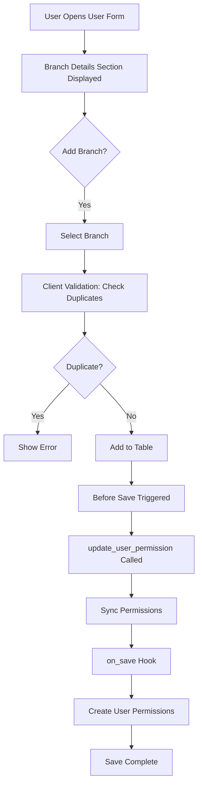
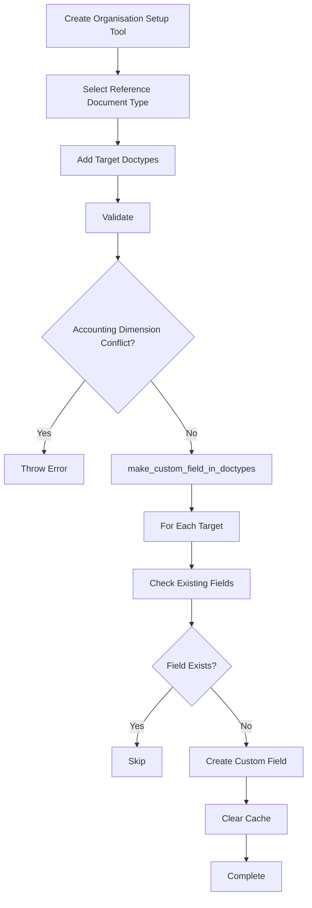

# Custom Field Logic Map - ERPNext Organization Structure Module

## 1. Executive Summary

The ERPNext Organization Structure module extends the standard ERPNext system with a sophisticated branch-based organizational hierarchy and access control system. This module implements:

- **4 static custom fields** across Branch and User doctypes
- **3 custom doctypes** for managing organizational structure
- **Dynamic field injection system** for extending any doctype with organizational dimensions
- **Branch-level permission management** with automatic User Permission synchronization
- **Accounting period validation** with branch-specific controls
- **Client and server-side validation** ensuring data integrity

The module's core functionality revolves around establishing branch-based data segregation, enabling multi-branch operations with controlled access and validation at both the transaction and accounting levels.

## 2. Custom Field Inventory (Static Fields)

### 2.1 Branch DocType Extensions

| Field Name | Field Type | Properties | Purpose |
|------------|------------|------------|---------|
| **abbr** | Data | - Required: Yes<br>- In List View: Yes<br>- Translatable: Yes<br>- Insert After: branch | Branch abbreviation for quick identification and reference |
| **address** | Link | - Required: Yes<br>- In List View: Yes<br>- Options: Address<br>- Insert After: abbr | Links branch to company address (filtered to company addresses only) |

### 2.2 User DocType Extensions

| Field Name | Field Type | Properties | Purpose |
|------------|------------|------------|---------|
| **branch_details_section** | Section Break | - Insert After: roles<br>- Label: Branch Details | Visual separator for branch assignment interface |
| **branch_details** | Table | - Options: Branch Details<br>- Mandatory Depends On: eval: !cur_frm.is_new()<br>- Insert After: branch_details_section | Multi-branch assignment table linking users to branches |

## 3. Custom DocTypes Analysis

### 3.1 Branch Details (Child Table)

**Purpose**: Enables many-to-many relationship between Users and Branches

**Structure**:
```json
{
  "istable": 1,
  "fields": [
    {
      "fieldname": "branch",
      "fieldtype": "Link",
      "options": "Branch"
    }
  ]
}
```

**Key Features**:
- Child table for User doctype
- Enables multiple branch assignments per user
- Triggers automatic User Permission creation/deletion

### 3.2 Injected Document Details (Child Table)

**Purpose**: Configuration table for dynamic field injection

**Structure**:
- Parent: Organisation Setup Tool
- Fields:
  - `reference_document`: Target doctype for field injection

**Key Features**:
- Defines which doctypes receive organizational dimension fields
- Validates against accounting dimension conflicts
- Supports bulk field injection across multiple doctypes

### 3.3 Organisation Setup Tool

**Purpose**: Central configuration for dynamic organizational dimensions

**Key Attributes**:
- `reference_document_type`: Source doctype (Branch/Department/Territory)
- `label`: Field label for injected fields
- `fieldname`: Programmatic field name
- `injected_document_details`: List of target doctypes

**Validation Rules**:
- Unique reference_document_type per instance
- Cannot modify reference_document_type after creation
- Prevents injection into doctypes with existing accounting dimensions

## 4. Client-Side Logic Analysis

### 4.1 user.js - User Branch Management

**Location**: `/erpnext_org_structure/doctype/user/user.js`

**Event Handlers**:

#### Before Save Hook
```javascript
before_save: function(frm) {
    // Synchronizes User Permissions with current branch assignments
    frappe.call({
        method: "update_user_permission",
        args: { email: frm.doc.email },
        async: false
    })
}
```

#### Branch Addition Validation
```javascript
branch: function(frm, cdt, cdn) {
    // Prevents duplicate branch assignments
    // Validates uniqueness across all branch_details rows
    // Throws user-friendly error on duplication
}
```

#### Branch Removal Handler
```javascript
before_branch_details_remove: function(frm, cdt, cdn) {
    // Immediately deletes corresponding User Permission
    // Ensures permission consistency on branch removal
}
```

### 4.2 branch.js - Branch Configuration

**Location**: `/erpnext_org_structure/doctype/branch/branch.js`

**Key Logic**:
```javascript
refresh: function(frm) {
    // Filters address field to company addresses only
    frm.set_query("address", function() {
        return {
            filters: { "is_your_company_address": 1 }
        };
    });
}
```

### 4.3 organisation_setup_tool.js - Dynamic Field Management

**Location**: `/erpnext_org_structure/doctype/organisation_setup_tool/organisation_setup_tool.js`

**Key Functions**:

#### Refresh Event
- Restricts reference_document_type to Branch/Department/Territory
- Filters injected documents to non-table doctypes only

#### Label Change Handler
```javascript
label: function(frm) {
    // Auto-generates fieldname from reference_document_type
    frm.set_value('fieldname', frappe.model.scrub(frm.doc.reference_document_type));
}
```

#### Field Removal Handler
```javascript
before_injected_document_details_remove: function(frm, cdt, cdn) {
    // Deletes custom field from target doctype
    // Synchronous operation to ensure completion
}
```

## 5. Server-Side Logic Analysis

### 5.1 User Permission Management (user.py)

**Core Functions**:

#### on_save Hook
```python
def on_save(self, document):
    # Creates User Permission for each branch assignment
    # Applies to all doctypes (apply_to_all_doctypes=1)
    # Skips existing permissions to prevent duplicates
```

#### delete_user_permission
```python
@frappe.whitelist()
def delete_user_permission(user, branch):
    # Removes specific branch permission
    # Called on branch removal from user
```

#### update_user_permission
```python
@frappe.whitelist()
def update_user_permission(email):
    # Synchronizes permissions with current branch list
    # Removes orphaned permissions
    # Maintains permission integrity
```

### 5.2 Dynamic Field Injection (organisation_setup_tool.py)

**Validation Logic**:
- Ensures unique reference_document_type
- Prevents modification of reference_document_type
- Validates against accounting dimension conflicts

**Field Creation Process**:
```python
def make_custom_field_in_doctypes(doc):
    # Creates Link field in target doctypes
    # Field properties:
    #   - fieldtype: Link
    #   - options: reference_document_type
    #   - insert_after: company
    # Clears cache after creation
```

**Cleanup Process**:
```python
def delete_custom_fields(doc):
    # Removes all injected fields on tool deletion
    # Direct SQL deletion for performance
```

### 5.3 Accounting Period Override (api.py)

**CustomAccountingPeriod Class**:

#### Overlap Validation
```python
def validate_overlap(self):
    # Branch-aware period overlap checking
    # Falls back to standard validation if branch field absent
    # SQL-based validation for performance
```

#### GL Entry Validation
```python
def validate_accounting_period(gl_map):
    # Checks for closed periods at branch level
    # Integrates with Accounting Dimension framework
    # Throws ClosedAccountingPeriod on violation
```

## 6. Custom Field Logic Flow Maps

### 6.1 User-Branch Assignment Flow



### 6.2 Dynamic Field Injection Flow



## 7. Custom Field Interaction Diagram

### 7.1 Branch Permission Architecture

```
┌─────────────┐     ┌──────────────┐     ┌──────────────────┐
│    User     │────▶│Branch Details│────▶│     Branch       │
└─────────────┘     └──────────────┘     └──────────────────┘
       │                    │                      │
       │                    │                      │
       ▼                    ▼                      ▼
┌─────────────┐     ┌──────────────┐     ┌──────────────────┐
│User Session │     │User Permission│────▶│Document Access   │
└─────────────┘     └──────────────┘     └──────────────────┘
```

### 7.2 Data Flow Sequence

1. **User Assignment**
   - User → Branch Details (1:N)
   - Branch Details → Branch (N:1)
   - Creates User Permission automatically

2. **Permission Application**
   - User Permission filters all doctypes with Branch field
   - Branch field presence determined by Organisation Setup Tool
   - Permissions cascade through document hierarchy

3. **Validation Chain**
   - Client-side: Duplicate prevention
   - Server-side: Permission synchronization
   - GL Entry: Branch-specific accounting period validation

## 8. Dynamic Field Injection System

### 8.1 System Architecture

```
Organisation Setup Tool
    │
    ├── Configuration
    │   ├── reference_document_type (Branch/Department/Territory)
    │   ├── label (Display name)
    │   └── fieldname (Programmatic name)
    │
    └── Injection Targets
        ├── Injected Document Details
        │   └── reference_document (Target DocType)
        │
        └── Field Creation
            ├── Type: Link
            ├── Options: reference_document_type
            └── Position: After 'company'
```

### 8.2 Injection Constraints

**Allowed Reference Types**:
- Branch
- Department
- Territory

**Excluded Doctypes**:
- Any doctype in `accounting_dimension_doctypes` hook
- Child tables (istable=1)
- System doctypes

### 8.3 Lifecycle Management

**Creation**:
1. Validate unique reference_document_type
2. Check for accounting dimension conflicts
3. Create custom fields in target doctypes
4. Clear doctype cache

**Modification**:
1. Prevent reference_document_type changes
2. Allow adding/removing injection targets
3. Synchronize field changes

**Deletion**:
1. Remove all injected custom fields
2. Clean up database records
3. Clear affected caches

## 9. Integration Points

### 9.1 Accounting Period Integration

**Hook Override**:
```python
# hooks.py
_standard_gl.validate_accounting_period = _custom_api.validate_accounting_period
```

**Enhanced Validation**:
- Standard: Company + Period
- Enhanced: Company + Branch + Period
- Fallback: Uses standard validation if branch field absent

**SQL Query Enhancement**:
```sql
-- Branch-aware period validation
SELECT ap.name
FROM `tabAccounting Period` ap, `tabClosed Document` cd
WHERE ap.name = cd.parent
  AND ap.company = %(company)s
  AND ap.branch = %(branch)s  -- Additional filter
  AND cd.closed = 1
  AND cd.document_type = %(voucher_type)s
  AND %(date)s BETWEEN ap.start_date AND ap.end_date
```

### 9.2 Accounting Dimension Framework

**Integration Check**:
```python
AD = frappe.db.get_value("Accounting Dimension", {"document_type": "Branch"}, "document_type")
```

**Behavior Matrix**:

| Accounting Dimension | Branch Field | Behavior |
|---------------------|--------------|----------|
| Present | Present | Branch-level validation |
| Present | Absent | Standard validation |
| Absent | Present | Standard validation |
| Absent | Absent | Standard validation |

### 9.3 Document Hooks

**JavaScript Hooks**:
```python
doctype_js = {
    "User": "erpnext_org_structure/doctype/user/user.js",
    "Quality Inspection": "erpnext_org_structure/doctype/quality_inspection/quality_inspection.js",
    "Branch": "erpnext_org_structure/doctype/branch/branch.js"
}
```

**Python Hooks**:
```python
doc_events = {
    "User": {
        "after_insert": ["...user.on_save"],
        "on_update": ["...user.on_save"]
    }
}
```

**Class Override**:
```python
override_doctype_class = {
    'Accounting Period': 'erpnext_org_structure.api.CustomAccountingPeriod'
}
```

## 10. Security and Performance Considerations

### 10.1 Security Features

**Permission Model**:
- Automatic User Permission creation
- Branch-level data segregation
- Permission cleanup on branch removal
- Apply to all doctypes flag ensures comprehensive coverage

**Validation Layers**:
- Client-side duplicate prevention
- Server-side permission synchronization
- Database-level constraint enforcement

### 10.2 Performance Optimizations

**Caching Strategy**:
- Clear cache after field injection
- Cached meta information usage
- Async operations where appropriate

**Database Operations**:
- Direct SQL for bulk operations
- Indexed queries on permission tables
- Batch processing for multiple branches

**Synchronization**:
- Synchronous operations for critical paths
- Asynchronous for non-blocking updates
- Transaction consistency maintained

## 11. Maintenance and Extension Guidelines

### 11.1 Adding New Organizational Dimensions

1. Add dimension type to `organisation_setup_tool.js` reference_document filter
2. Ensure dimension doctype has appropriate structure
3. Test field injection and cleanup
4. Update documentation

### 11.2 Extending Accounting Integration

1. Check for dimension in `validate_accounting_period`
2. Add appropriate SQL filters
3. Maintain fallback behavior
4. Test with various configurations

### 11.3 Custom Field Naming Convention

- Section fields: `{context}_section`
- Detail tables: `{context}_details`
- Link fields: Use descriptive names
- Maintain consistency with ERPNext standards

## 12. Testing Checklist

### 12.1 User-Branch Assignment
- [ ] Single branch assignment
- [ ] Multiple branch assignment
- [ ] Duplicate branch prevention
- [ ] Branch removal and permission cleanup
- [ ] Permission synchronization on save

### 12.2 Dynamic Field Injection
- [ ] Field creation in target doctypes
- [ ] Duplicate field prevention
- [ ] Field removal on deletion
- [ ] Cache clearing verification
- [ ] Accounting dimension conflict detection

### 12.3 Accounting Period Validation
- [ ] Branch-specific period enforcement
- [ ] Overlap detection with branch
- [ ] GL entry validation
- [ ] Fallback to standard validation

### 12.4 Integration Points
- [ ] JavaScript file loading
- [ ] Python hook execution
- [ ] Class override functionality
- [ ] Permission application across doctypes

## Conclusion

The ERPNext Organization Structure module provides a robust framework for implementing branch-based organizational hierarchies with comprehensive access control and validation mechanisms. The system's modular design allows for easy extension while maintaining data integrity and security through multiple validation layers. The dynamic field injection system enables flexible configuration without code modifications, making it suitable for diverse organizational structures.