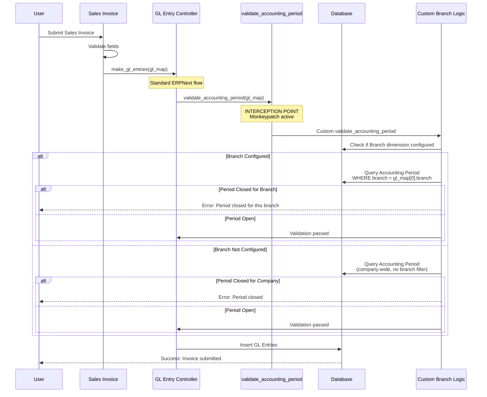
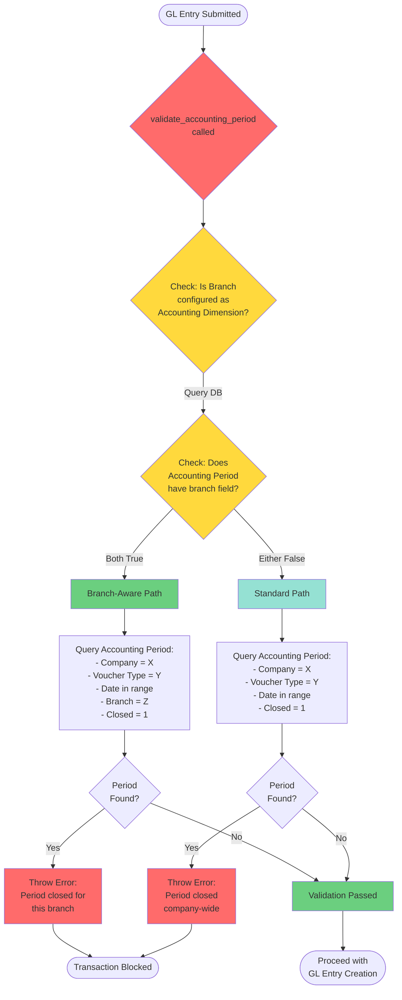
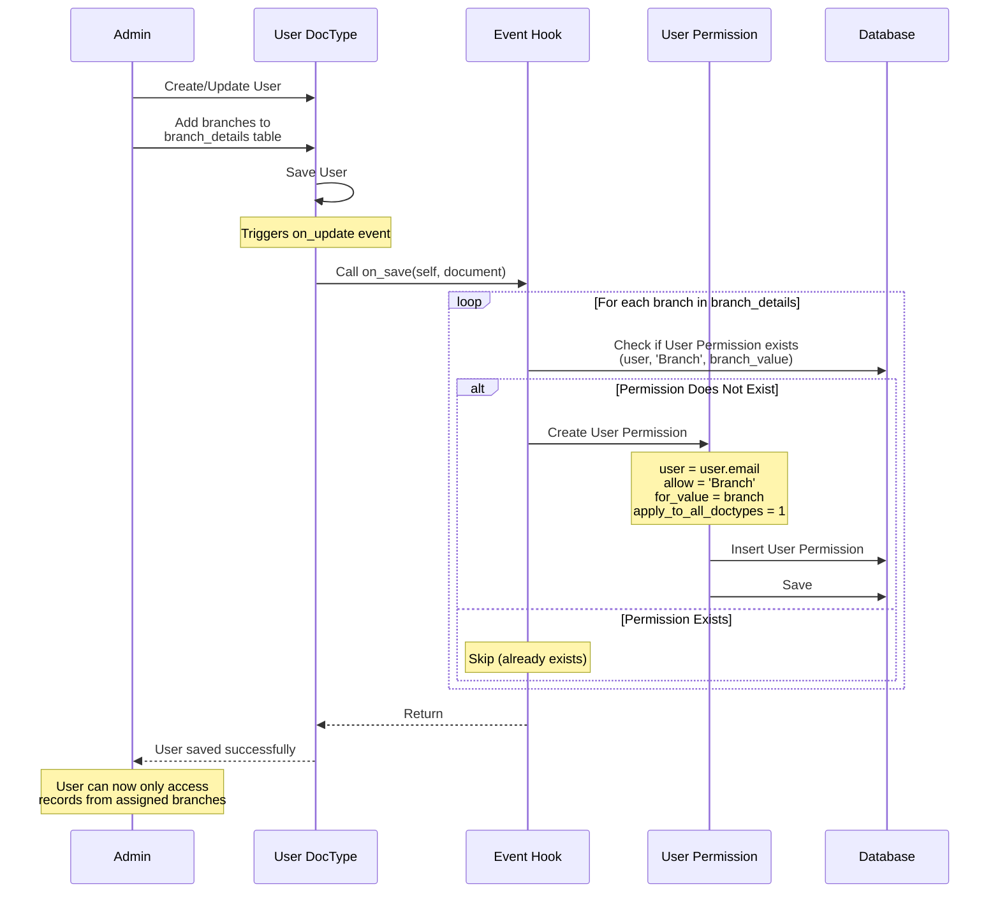
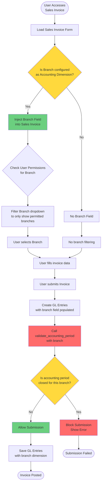
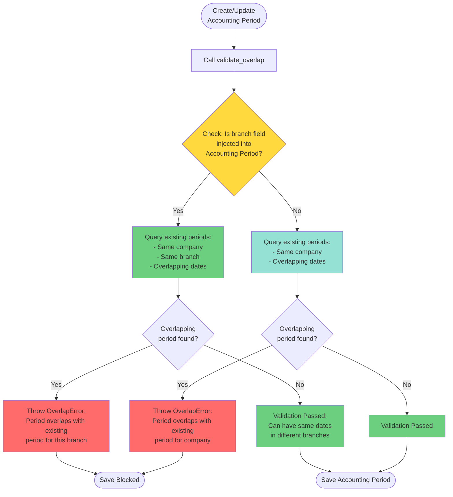

# ERPNext Override Specification - erpnext_org_structure

## Executive Summary

- **Total Document Event Hooks**: 2 (User after_insert, User on_update)
- **Total Controller Overrides**: 1 (CustomAccountingPeriod)
- **CRITICAL OVERRIDE**: GL Entry validation monkeypatch via direct module reassignment
- **Overall Risk Assessment**: **CRITICAL**
- **Upgrade Impact**: **VERY HIGH** (direct core accounting override at module load time)
- **Accounting Dimensions**: 35+ doctypes configured with branch-based filtering
- **Architecture Pattern**: Direct monkeypatch + controller override + auto permission injection

### Risk Severity Breakdown
- **Method Monkeypatch**: CRITICAL (direct GL validation override)
- **Controller Override**: HIGH (accounting period customization)
- **Auto Permission Injection**: MEDIUM (user permission auto-creation)
- **Dimension Configuration**: LOW (standard Frappe feature)

## Override Inventory

### Method Monkeypatches - HIGHEST RISK

| Original Method | Module | Replaced By | Risk Level | Impact Scope |
|----------------|---------|-------------|------------|--------------|
| `validate_accounting_period` | `erpnext.accounts.general_ledger` | `erpnext_org_structure.api.validate_accounting_period` | **CRITICAL** | ALL GL Entry creation/modification system-wide |

**Monkeypatch Implementation Location**:
- File: `/erpnext_org_structure/hooks.py` (Lines 5-7, 17)
- Pattern: Direct module attribute reassignment at import time

```python
# Line 5-7: Import both standard and custom modules
import erpnext.accounts.general_ledger as _standard_gl
import erpnext_org_structure.api as _custom_api

# Line 17: CRITICAL MONKEYPATCH - Direct function replacement
_standard_gl.validate_accounting_period = _custom_api.validate_accounting_period
```

**Why This is CRITICAL**:
1. **Executes at module load time** - No way to disable without code modification
2. **Replaces core accounting validation** - Affects ALL GL transactions
3. **No fallback mechanism** - If custom function fails, GL entries break
4. **Invisible to standard Frappe hooks** - Cannot be traced via hook inventory
5. **Breaks with signature changes** - Any ERPNext parameter change causes immediate failure
6. **Debugging nightmare** - Stack traces show original function name, not custom implementation

### Controller Overrides

| DocType | Original Class | Custom Class | Purpose | Risk Level |
|---------|---------------|--------------|---------|------------|
| Accounting Period | `erpnext.accounts.doctype.accounting_period.accounting_period.AccountingPeriod` | `erpnext_org_structure.api.CustomAccountingPeriod` | Branch-aware accounting period overlap validation | **HIGH** |

**Implementation Location**:
- Configuration: `/erpnext_org_structure/hooks.py` (Lines 55-57)
- Class Definition: `/erpnext_org_structure/api.py` (Lines 7-44)

```python
# hooks.py - Line 55-57
override_doctype_class = {
    'Accounting Period': 'erpnext_org_structure.api.CustomAccountingPeriod'
}
```

### Document Event Hooks

| DocType | Event | Handler Method | Purpose | Risk Level |
|---------|-------|---------------|---------|------------|
| User | after_insert | `erpnext_org_structure.erpnext_org_structure.doctype.user.user.on_save` | Auto-create branch permissions | MEDIUM |
| User | on_update | `erpnext_org_structure.erpnext_org_structure.doctype.user.user.on_save` | Sync branch permissions | MEDIUM |

**Implementation Location**:
- Configuration: `/erpnext_org_structure/hooks.py` (Lines 48-53)
- Handler Code: `/erpnext_org_structure/erpnext_org_structure/doctype/user/user.py` (Lines 12-21)

### Accounting Dimension Configuration

**Total Doctypes Affected**: 35 doctypes with branch-based filtering enabled

**Configuration Location**: `/erpnext_org_structure/hooks.py` (Lines 19-26)

**Core Accounting Doctypes**:
- GL Entry (PRIMARY - all accounting flows through this)
- Sales Invoice, Purchase Invoice, Payment Entry
- Journal Entry Account
- Asset, Asset Value Adjustment
- Budget, Payroll Entry

**Inventory & Fulfillment Doctypes**:
- Stock Entry, Stock Entry Detail, Stock Reconciliation
- Delivery Note, Delivery Note Item
- Purchase Receipt Item
- Material Request Item

**Tax & Charges Doctypes**:
- Sales Taxes and Charges
- Purchase Taxes and Charges
- Expense Taxes and Charges

**Expense & Claims**:
- Expense Claim, Expense Claim Detail

**Advanced Features**:
- POS Profile, Subscription, Subscription Plan
- Loyalty Program, Fee Schedule, Fee Structure
- Shipping Rule, Landed Cost Item
- Opening Invoice Creation Tool, Opening Invoice Creation Tool Item
- Travel Request, Fees

**Impact**: All these doctypes receive dynamic branch field injection and user permission filtering based on branch assignments.

## Detailed Override Analysis

### CRITICAL: GL Entry Validation Override

#### Override Metadata
- **Override Type**: Direct monkeypatch (HIGHEST RISK - bypasses Frappe framework)
- **Original Method**: `erpnext.accounts.general_ledger.validate_accounting_period`
- **Replaced By**: `erpnext_org_structure.api.validate_accounting_period`
- **Monkeypatch Location**: `/erpnext_org_structure/hooks.py:17`
- **Implementation Location**: `/erpnext_org_structure/api.py:46-91`
- **Execution Timing**: Module load time (before any request processing)

#### Code Pattern Analysis

**Monkeypatch Pattern (hooks.py:5-7, 17)**:
```python
import erpnext.accounts.general_ledger as _standard_gl
import erpnext_org_structure.api as _custom_api

# Direct attribute reassignment - bypasses all Frappe hooks
_standard_gl.validate_accounting_period = _custom_api.validate_accounting_period
```

**Custom Implementation (api.py:46-91)**:
```python
def validate_accounting_period(gl_map):
    # Line 47-48: Check if branch accounting dimension is configured
    AD = frappe.db.get_value("Accounting Dimension",
                             {"document_type":"Branch"}, "document_type")
    branch_field = frappe.db.get_value("Injected Document Details",
                                       {"reference_document":"Accounting Period",
                                        "parent":"Branch",
                                        "parenttype":"Organisation Setup Tool"},
                                       "reference_document")

    # BRANCH-AWARE VALIDATION PATH
    if branch_field and AD:
        accounting_periods = frappe.db.sql(""" SELECT ap.name as name
            FROM `tabAccounting Period` ap, `tabClosed Document` cd
            WHERE ap.name = cd.parent
                AND ap.company = %(company)s
                AND cd.closed = 1
                AND cd.document_type = %(voucher_type)s
                AND %(date)s between ap.start_date and ap.end_date
                AND ap.branch = %(branch)s  # <-- CRITICAL: Branch filter added
            """, {
                'date': gl_map[0].posting_date,
                'company': gl_map[0].company,
                'voucher_type': gl_map[0].voucher_type,
                'branch': gl_map[0].branch  # <-- Requires branch in gl_map
            }, as_dict=1)

        if accounting_periods:
            frappe.throw(_("You cannot create or cancel any accounting entries "
                          "with in the closed Accounting Period {0}")
                        .format(frappe.bold(accounting_periods[0].name)),
                        ClosedAccountingPeriod)

    # STANDARD VALIDATION PATH (fallback if branch not configured)
    else:
        accounting_periods = frappe.db.sql(""" SELECT ap.name as name
            FROM `tabAccounting Period` ap, `tabClosed Document` cd
            WHERE ap.name = cd.parent
                AND ap.company = %(company)s
                AND cd.closed = 1
                AND cd.document_type = %(voucher_type)s
                AND %(date)s between ap.start_date and ap.end_date
                # No branch filter in fallback path
            """, {
                'date': gl_map[0].posting_date,
                'company': gl_map[0].company,
                'voucher_type': gl_map[0].voucher_type
            }, as_dict=1)

        if accounting_periods:
            frappe.throw(_("You cannot create or cancel any accounting entries "
                          "with in the closed Accounting Period {0}")
                        .format(frappe.bold(accounting_periods[0].name)),
                        ClosedAccountingPeriod)
```

#### Original ERPNext Flow

**Standard ERPNext**: `erpnext.accounts.general_ledger.validate_accounting_period`
1. Receives `gl_map` (list of GL Entry dicts)
2. Queries Accounting Period + Closed Document for company/date/voucher_type match
3. Throws error if closed period found (company-wide enforcement)
4. No branch-level granularity

#### Custom Logic Injected

**Branch-Aware Flow** (api.py:46-91):
1. **Configuration Check** (Lines 47-48):
   - Checks if Branch is configured as Accounting Dimension
   - Checks if Accounting Period has branch field injected

2. **Conditional Branch Validation** (Lines 49-70):
   - If branch configuration exists: Add `ap.branch = %(branch)s` filter
   - Requires `gl_map[0].branch` attribute (expects branch in GL entry)
   - Only validates against accounting periods for THAT SPECIFIC BRANCH

3. **Fallback Standard Validation** (Lines 72-91):
   - If branch not configured: Uses company-wide validation
   - Identical to original ERPNext logic

#### Business Purpose

**Problem Solved**: Allow different branches to have independent accounting period closures
- Branch A can close Q1 2024 while Branch B remains open
- Head office can enforce period closure per branch independently
- Supports multi-branch organizations with decentralized accounting

**Use Case Example**:
```
Company: ABC Corp
- Branch: Mumbai (closed for Jan 2024)
- Branch: Delhi (open for Jan 2024)

GL Entry for Mumbai + Jan 2024 -> BLOCKED
GL Entry for Delhi + Jan 2024 -> ALLOWED
```

#### Impact Scope

**Affected Transactions** (ALL accounting operations):
- Sales Invoice (submit/cancel)
- Purchase Invoice (submit/cancel)
- Payment Entry (submit/cancel)
- Journal Entry (submit/cancel)
- Stock Entry with accounting impact
- Asset creation/disposal
- Payroll Entry
- Expense Claim processing
- Opening balances
- Period closing entries
- **EVERY transaction that creates GL entries**

**Execution Frequency**:
- 1-100+ times per GL entry creation (depending on number of accounting rows)
- Can execute thousands of times per day in active systems

#### Risk Assessment

##### Upgrade Risk: CRITICAL
**Why**:
- ERPNext core method signature changes will cause immediate breakage
- No version compatibility checking
- Monkeypatch happens before any migration scripts run
- Cannot be disabled without code modification

**Failure Scenarios**:
1. ERPNext adds new parameter to `validate_accounting_period(gl_map, new_param)`
   - Result: TypeError - missing required argument
   - Impact: ALL GL entries fail system-wide

2. ERPNext renames or moves the function
   - Result: AttributeError at module load
   - Impact: Application fails to start

3. ERPNext changes `gl_map` structure (removes/renames attributes)
   - Result: AttributeError when accessing `gl_map[0].branch`
   - Impact: ALL GL entries fail

4. ERPNext refactors to use class-based validation
   - Result: Method replacement no longer works
   - Impact: Custom validation silently bypassed or app crashes

##### Data Integrity Risk: HIGH
**Why**:
- Incorrect branch detection could allow entries in closed periods
- Missing branch field causes fallback to company-wide validation (security bypass)
- SQL injection risk if branch value not sanitized (Frappe handles this, but risk exists)

**Data Corruption Scenarios**:
1. Branch field missing from gl_map -> Falls back to company-wide check
   - Could allow entries in branch-closed periods

2. Branch dimension configuration partially applied
   - Inconsistent validation across different entry types

3. Race condition: Accounting period closed while transaction in progress
   - Multi-step transactions could partially complete

##### Performance Impact: MEDIUM
**Why**:
- Extra database queries for configuration check (Lines 47-48)
- Two DB queries per validation vs one in standard ERPNext
- Query includes JOIN on Closed Document table

**Performance Cost**:
```
Standard ERPNext: 1 SQL query
Custom Logic: 2-3 SQL queries
  - Query 1: Check Accounting Dimension config
  - Query 2: Check Injected Document Details
  - Query 3: Actual validation (with branch filter)
```

**Mitigation**: These are small queries, but execute on EVERY GL entry

##### Maintenance Risk: CRITICAL
**Why**:
- Monkeypatch invisible in standard Frappe hook queries
- Stack traces misleading (show original function name)
- Cannot be disabled without editing Python code
- No test coverage can be guaranteed for ERPNext changes
- Debugging requires deep knowledge of both systems

**Maintenance Challenges**:
1. Developer sees "validate_accounting_period" in traceback
   - Must know to check for monkeypatch in hooks.py

2. ERPNext updates require manual regression testing
   - No automated way to detect breaking changes

3. Cannot use ERPNext's standard accounting period fixes
   - Must manually port fixes to custom implementation

4. Future developers may not discover this override
   - No runtime indication that function is replaced

#### Security Considerations

**Potential Security Issues**:
1. **Bypass Risk**: If branch field missing, falls back to weaker company-wide validation
2. **Privilege Escalation**: User might manipulate branch field to access closed periods
3. **Audit Trail**: No logging that custom validation executed vs standard
4. **Configuration Tampering**: If Injected Document Details modified, validation changes

**Required Security Controls**:
- Validate branch field comes from trusted source (DocType field, not user input)
- Log when fallback validation path used
- Monitor Accounting Dimension and Injected Document Details for unauthorized changes
- Restrict permissions on Organisation Setup Tool

#### Monkeypatch Code Pattern Documentation

**Pattern Name**: Direct Module Attribute Reassignment

**Implementation**:
```python
# Step 1: Import target module and custom module
import erpnext.accounts.general_ledger as _standard_gl
import erpnext_org_structure.api as _custom_api

# Step 2: Replace function attribute
_standard_gl.validate_accounting_period = _custom_api.validate_accounting_period
```

**How It Works**:
1. Python modules are objects with mutable attributes
2. Functions are just attributes on module objects
3. Reassigning attribute replaces function reference
4. All future imports get the replaced function
5. Happens at module load time (when hooks.py imported)

**Why It's Dangerous**:
- Bypasses Frappe's hook system entirely
- No registration or visibility in framework
- Cannot be controlled by configuration
- Fails silently if function signature mismatches
- No rollback mechanism
- Affects ALL code paths, not just custom code

**Comparison to Safer Patterns**:

| Pattern | Visibility | Controllability | Upgrade Safety | Risk Level |
|---------|-----------|----------------|----------------|------------|
| Monkeypatch (current) | None | None | Very Low | CRITICAL |
| override_whitelisted_methods | Hook registry | Config-based | Medium | MEDIUM |
| doc_events hooks | Hook registry | Config-based | High | LOW |
| Custom DocType | Full | Standard | High | LOW |

### CustomAccountingPeriod Override

#### Override Metadata
- **Override Type**: Controller class override (via override_doctype_class hook)
- **Original Class**: `erpnext.accounts.doctype.accounting_period.accounting_period.AccountingPeriod`
- **Custom Class**: `erpnext_org_structure.api.CustomAccountingPeriod`
- **Configuration Location**: `/erpnext_org_structure/hooks.py:55-57`
- **Implementation Location**: `/erpnext_org_structure/api.py:7-44`
- **Hook Type**: Frappe standard override mechanism (safer than monkeypatch)

#### Custom Methods Overridden

**Method**: `validate_overlap(self)` (Lines 8-44)

**Original Behavior** (ERPNext Standard):
- Checks for overlapping accounting periods within same company
- Query: Company + Date Range overlap detection
- Prevents multiple periods covering same dates for one company

**Custom Behavior** (erpnext_org_structure):
```python
def validate_overlap(self):
    # Line 9: Check if branch field injected into Accounting Period
    branch_field = frappe.db.get_value("Injected Document Details",
                                       {"reference_document":"Accounting Period",
                                        "parent":"Branch",
                                        "parenttype":"Organisation Setup Tool"},
                                       "reference_document")

    # BRANCH-AWARE VALIDATION PATH
    if branch_field:
        existing_accounting_period = frappe.db.sql("""
            select name from `tabAccounting Period`
            where (
                (%(start_date)s between start_date and end_date)
                or (%(end_date)s between start_date and end_date)
                or (start_date between %(start_date)s and %(end_date)s)
                or (end_date between %(start_date)s and %(end_date)s)
            )
            and name!=%(name)s
            and company=%(company)s
            and branch=%(branch)s  # <-- CRITICAL: Branch-specific overlap check
        """, {
            "start_date": self.start_date,
            "end_date": self.end_date,
            "name": self.name,
            "company": self.company,
            "branch": self.branch  # <-- Requires branch field
        }, as_dict=True)

        if len(existing_accounting_period) > 0:
            frappe.throw(_("Accounting Period overlaps with {0}")
                        .format(existing_accounting_period[0].get("name")),
                        OverlapError)

    # STANDARD VALIDATION PATH (fallback)
    else:
        # Lines 29-44: Standard ERPNext validation (company-wide)
        existing_accounting_period = frappe.db.sql("""
            select name from `tabAccounting Period`
            where (
                (%(start_date)s between start_date and end_date)
                or (%(end_date)s between start_date and end_date)
                or (start_date between %(start_date)s and %(end_date)s)
                or (end_date between %(start_date)s and %(end_date)s)
            )
            and name!=%(name)s
            and company=%(company)s
            # No branch filter
        """, {
            "start_date": self.start_date,
            "end_date": self.end_date,
            "name": self.name,
            "company": self.company
        }, as_dict=True)

        if len(existing_accounting_period) > 0:
            frappe.throw(_("Accounting Period overlaps with {0}")
                        .format(existing_accounting_period[0].get("name")),
                        OverlapError)
```

#### Business Purpose

**Problem Solved**: Allow overlapping accounting periods across different branches
- Branch A can have "Q1 2024" from Jan-Mar
- Branch B can also have "Q1 2024" from Jan-Mar
- Without branch awareness, ERPNext would block this as "overlap"

**Use Case Example**:
```
Company: ABC Corp
- Create Accounting Period "Q1-2024-Mumbai" for Mumbai branch (Jan-Mar)
- Create Accounting Period "Q1-2024-Delhi" for Delhi branch (Jan-Mar)

Standard ERPNext: BLOCKED (detects overlap)
Custom Logic: ALLOWED (different branches)
```

#### Impact Scope

**Affected Operations**:
- Creating new Accounting Periods
- Modifying existing Accounting Period dates
- Validating period closure configurations

**Frequency**: Low (administrative operation, not transaction-level)

#### Risk Assessment

##### Upgrade Risk: HIGH
**Why**:
- Depends on base class method signature
- ERPNext could add new validation logic to parent method
- If parent class refactored, override might miss new validations

**Failure Scenarios**:
1. ERPNext adds new validation in parent `validate_overlap()`
   - Result: Custom override bypasses new validation
   - Impact: Data integrity issues

2. ERPNext renames method or moves to different validation flow
   - Result: Override never called
   - Impact: Branch validation lost

3. ERPNext changes validation to use class properties not in custom class
   - Result: AttributeError
   - Impact: Accounting Period creation fails

##### Data Integrity Risk: MEDIUM
**Why**:
- Allows overlapping periods (by design, but could be confusing)
- Fallback to standard validation if branch not configured
- Potential for configuration errors allowing unintended overlaps

**Data Issues**:
1. Branch field missing -> Falls back to company-wide check
   - Inconsistent behavior across periods

2. Branch configuration partially applied
   - Some periods branch-aware, others company-wide

3. Multiple periods with same dates but different branches
   - Reporting queries must account for branch filter

##### Maintenance Risk: MEDIUM
**Why**:
- Safer than monkeypatch (uses standard Frappe hook)
- Visible in override_doctype_class registry
- Must manually sync with ERPNext base class changes
- Need to monitor for new validation methods in parent

**Maintenance Requirements**:
- Review ERPNext release notes for Accounting Period changes
- Test period creation/modification after each ERPNext upgrade
- Ensure branch field always present when branch validation active

### Dynamic Field Injection System

#### User Permission Auto-Creation

**Implementation Location**: `/erpnext_org_structure/erpnext_org_structure/doctype/user/user.py:12-21`

**Trigger**: User after_insert and on_update events

**Logic** (on_save function):
```python
def on_save(self, document):
    # Iterate through branch_details child table
    for row in self.branch_details:
        # Check if User Permission already exists
        if not frappe.db.exists("User Permission",
                                {'user': self.email,
                                 'allow': 'Branch',
                                 'for_value': row.branch}):
            # Create new User Permission
            up_doc = frappe.get_doc(dict(
                doctype='User Permission',
                user=self.email,
                allow="Branch",
                for_value=row.branch,
                apply_to_all_doctypes=1  # <-- CRITICAL: Global filter
            )).insert(ignore_mandatory=True)
            up_doc.save()
```

**Key Feature**: `apply_to_all_doctypes=1`
- User can only see/access records matching their assigned branches
- Applies to ALL 35+ accounting dimension doctypes
- Creates automatic data isolation by branch

**Sync Logic** (update_user_permission function, Lines 30-37):
```python
def update_user_permission(email):
    # Get all branches assigned to user
    branches = []
    for doc_name in frappe.db.get_list("Branch Details",
                                        {'parent': email,
                                         'parenttype': 'User'}, 'branch'):
        if doc_name:
            branches.append(doc_name.branch)

    # Delete permissions for branches no longer assigned
    if branches:
        for user_perm in frappe.db.get_list("User Permission",
                                             {'user': email,
                                              'allow': 'Branch',
                                              'for_value': ('not in', branches)},
                                             'for_value'):
            delete_user_permission(email, user_perm.for_value)
```

#### Apply_to_all_doctypes Impact

**What It Does**:
- Automatically adds WHERE clause filter to ALL doctype queries
- User sees only records where Branch matches their permissions
- Applies to:
  - List views
  - Link field searches
  - Report queries (if not bypassed)
  - API calls

**Data Isolation Example**:
```
User: john@company.com
Assigned Branches: Mumbai, Pune

Query: "Show all Sales Invoices"
Actual SQL: SELECT * FROM `tabSales Invoice`
            WHERE branch IN ('Mumbai', 'Pune')

User cannot see Sales Invoices from Delhi branch
```

**Security Implication**:
- Strong row-level security
- Prevents cross-branch data access
- Can block system administrators if not careful

#### Accounting Dimension Application

**Configuration**: hooks.py:19-26 (35 doctypes)

**How Branch Field Gets Injected**:
1. Organisation Setup Tool (separate custom app/feature)
2. Creates "Injected Document Details" records
3. Dynamically adds "branch" field to configured doctypes
4. ERPNext's Accounting Dimension framework handles the rest

**Validation Flow**:
1. User creates Sales Invoice
2. Branch field required (via accounting dimension config)
3. User Permission filters available branches in dropdown
4. On submit -> GL Entry created with branch field
5. validate_accounting_period checks branch-specific closed periods

## Process Flow Diagrams

### 1. GL Entry Creation Flow with Branch Validation Override



### 2. Accounting Period Validation Flow (Detailed)



### 3. User Permission Auto-Creation Flow



### 4. Accounting Dimension Application Flow



### 5. Accounting Period Overlap Validation Flow



## Upgrade Risk Assessment Matrix

| Override | Risk Level | Upgrade Concern | Mitigation Strategy |
|----------|-----------|-----------------|---------------------|
| GL validation monkeypatch | **CRITICAL** | Core method signature changes, function rename/move, gl_map structure changes, refactoring to class-based validation | 1. Pin ERPNext version in requirements<br/>2. Manual code review before every ERPNext upgrade<br/>3. Comprehensive integration test suite<br/>4. Monitor ERPNext GitHub accounting module changes<br/>5. Consider refactoring to override_whitelisted_methods if API available |
| CustomAccountingPeriod | **HIGH** | Base class method changes, new validation logic added, method rename, class refactoring | 1. Review ERPNext Accounting Period changes in release notes<br/>2. Test period creation/modification thoroughly<br/>3. Call super() if appropriate to preserve base validations<br/>4. Monitor for new validation methods |
| User permission auto-creation | **MEDIUM** | User Permission schema changes, branch_details table structure changes, Frappe hook signature changes | 1. Test user creation/update after framework upgrades<br/>2. Verify User Permission still supports apply_to_all_doctypes<br/>3. Check for deprecation warnings |
| Accounting dimension config | **LOW** | Accounting Dimension framework changes, deprecation of accounting_dimension_doctypes hook | 1. Follow Frappe/ERPNext dimension documentation<br/>2. Test one doctype from each category after upgrade<br/>3. Verify dimension filters still apply |

### Version Compatibility Tracking

**Current Implementation Compatibility**:
- **Tested ERPNext Version**: Unknown (CRITICAL - must document)
- **Tested Frappe Version**: Unknown (CRITICAL - must document)
- **Python Version**: Unknown
- **Last Verified Date**: Unknown

**Recommended Documentation**:
```python
# Add to hooks.py or separate version_info.py
COMPATIBILITY = {
    'erpnext_version': '14.x.x',  # Exact version tested
    'frappe_version': '14.x.x',
    'last_tested_date': '2024-01-15',
    'breaking_changes_tracked': [
        'erpnext.accounts.general_ledger.validate_accounting_period',
        'erpnext.accounts.doctype.accounting_period.accounting_period.AccountingPeriod'
    ]
}
```

## Architecture Concerns

### Monkeypatching Risks

#### Why Monkeypatching is Dangerous

**1. Invisible Override**
- Not registered in Frappe's hook system
- Cannot be discovered via standard tools
- No runtime indication that function is replaced
- Misleading stack traces (show original function name)

```python
# Developer debugging sees:
# File "erpnext/accounts/general_ledger.py", line X, in validate_accounting_period
# But actual code executing is in erpnext_org_structure/api.py
```

**2. Upgrade Fragility**
- Breaks silently if function signature changes
- No compile-time or import-time validation
- ERPNext has no contract to maintain signature
- May break between minor version upgrades

**3. Execution Timing**
- Happens at module load time (before framework ready)
- Cannot be controlled by configuration
- Cannot be disabled without code changes
- Affects ALL code paths (custom + standard)

**4. Testing Challenges**
- Cannot test "original" behavior in custom code
- Unit tests may not reflect production behavior
- Integration tests required for every code path
- Mocking becomes extremely complex

**5. Maintenance Burden**
- Must manually track ERPNext source code changes
- Need to review every ERPNext upgrade
- Difficult for new developers to understand
- No automated upgrade path

#### Debugging Difficulties

**Scenario 1: Stack Trace Confusion**
```
Error in GL Entry creation:
  File "erpnext/accounts/general_ledger.py", line 234, in make_gl_entries
    validate_accounting_period(gl_map)
  File "erpnext/accounts/general_ledger.py", line 89, in validate_accounting_period
    # Stack trace shows THIS location
  TypeError: 'NoneType' object is not subscriptable

Developer looks at erpnext/accounts/general_ledger.py:89
But actual error is in erpnext_org_structure/api.py:62 (gl_map[0].branch)
```

**Scenario 2: Breakpoint Issues**
```python
# Developer sets breakpoint in original file
# erpnext/accounts/general_ledger.py:89
# Breakpoint NEVER hits (function replaced)

# Must know to set breakpoint in custom file
# erpnext_org_structure/api.py:46
```

**Scenario 3: Log Analysis**
```
[2024-01-15 10:23:45] Calling validate_accounting_period
[2024-01-15 10:23:45] In erpnext.accounts.general_ledger module
# Logs show original module name, not custom implementation
```

#### Alternative Approaches

**Option 1: override_whitelisted_methods (RECOMMENDED)**
```python
# hooks.py
override_whitelisted_methods = {
    "erpnext.accounts.general_ledger.validate_accounting_period":
        "erpnext_org_structure.api.validate_accounting_period"
}
```
**Pros**:
- Visible in Frappe hook registry
- Standard framework pattern
- Can be documented/discovered
- Better error messages

**Cons**:
- Only works for @frappe.whitelist() methods
- validate_accounting_period may not be whitelisted

**Option 2: Document Event Hooks**
```python
# hooks.py
doc_events = {
    "GL Entry": {
        "validate": "erpnext_org_structure.api.validate_gl_entry_accounting_period"
    }
}
```
**Pros**:
- Standard Frappe pattern
- Configurable per doctype
- Clear execution order
- Framework managed

**Cons**:
- validate_accounting_period called from make_gl_entries, not GL Entry.validate
- Would require refactoring ERPNext's GL creation flow

**Option 3: Custom GL Entry Controller**
```python
# hooks.py
override_doctype_class = {
    'GL Entry': 'erpnext_org_structure.custom_gl_entry.CustomGLEntry'
}
```
**Pros**:
- Standard override pattern
- All GL Entry logic customizable
- Discoverable

**Cons**:
- GL Entry is core accounting - very risky to override
- More code to maintain
- Still need to replicate standard logic

**Option 4: Fork ERPNext (LAST RESORT)**
**Pros**:
- Complete control
- No monkey patching

**Cons**:
- Cannot receive ERPNext updates
- Must manually merge upstream changes
- Massive maintenance burden

### Tight Coupling to ERPNext Core

#### Dependencies Analysis

**Direct Dependencies**:
1. `erpnext.accounts.general_ledger.validate_accounting_period` - CRITICAL
2. `erpnext.accounts.doctype.accounting_period.accounting_period.AccountingPeriod` - HIGH
3. Accounting Dimension framework - MEDIUM
4. User Permission system - LOW (Frappe core)

**Implicit Dependencies**:
1. GL Entry doctype structure (expects specific fields)
2. Accounting Period doctype structure
3. Closed Document child table
4. Branch doctype (from same app, but still dependency)
5. Organisation Setup Tool (separate app/feature)

#### Coupling Risk Matrix

| Component | Coupling Level | Change Frequency | Risk |
|-----------|---------------|------------------|------|
| GL Entry validation logic | **CRITICAL** | Medium (every major release) | Very High |
| Accounting Period validation | **HIGH** | Low (stable feature) | High |
| Accounting Dimension framework | **MEDIUM** | Medium (active development) | Medium |
| User Permission model | **LOW** | Low (stable core) | Low |

#### Change Propagation

**ERPNext Change -> Required Custom Code Changes**:

1. **GL validation signature change**
   ```python
   # ERPNext v15: validate_accounting_period(gl_map, company=None)
   # Requires custom code update or immediate failure
   ```

2. **GL Entry field rename**
   ```python
   # ERPNext renames 'branch' to 'cost_center_branch'
   # Custom code breaks: gl_map[0].branch -> AttributeError
   ```

3. **Accounting Period refactoring**
   ```python
   # ERPNext moves to AccountingPeriodManager class
   # CustomAccountingPeriod inherits from obsolete class
   ```

4. **Closed Document table changes**
   ```python
   # ERPNext adds 'closed_by_role' field
   # Custom SQL query may need updates
   ```

#### Monitoring Strategy

**Required Monitoring**:
1. **GitHub Watch**: ERPNext repository
   - Watch: `erpnext/accounts/general_ledger.py`
   - Watch: `erpnext/accounts/doctype/accounting_period/`
   - Alert on commits to these files

2. **Release Note Review**: Before every upgrade
   - Search for: "accounting period"
   - Search for: "general ledger"
   - Search for: "GL Entry"
   - Search for: "accounting dimension"

3. **Automated Testing**: After every ERPNext upgrade
   - Test: GL Entry creation with branch
   - Test: Accounting Period creation with overlap
   - Test: Closed period enforcement
   - Test: User permission filtering

4. **Version Pinning**: requirements.txt
   ```
   # Pin exact versions, not ranges
   erpnext==14.27.5  # NOT erpnext>=14.0.0
   ```

## Recommendations

### CRITICAL Priority

1. **Document Exact ERPNext Version Compatibility**
   - **Action**: Create `COMPATIBILITY.md` with exact ERPNext/Frappe versions tested
   - **Include**: Git commit hash of ERPNext version used for development
   - **Include**: Date of last compatibility verification
   - **Rationale**: Essential for upgrade planning and troubleshooting

2. **Create Comprehensive Test Suite for GL Entry Validation**
   - **Action**: Write integration tests covering:
     - GL entry with branch + open period (should pass)
     - GL entry with branch + closed period (should fail)
     - GL entry without branch configuration (should fall back)
     - GL entry with missing branch field (should handle gracefully)
   - **Include**: Performance benchmarks (validate no major slowdown)
   - **Rationale**: Only way to detect breaking changes after upgrades

3. **Add Runtime Verification of Monkeypatch**
   - **Action**: Add startup check in hooks.py:
   ```python
   # After line 17
   import inspect
   if inspect.getfile(_standard_gl.validate_accounting_period) != inspect.getfile(_custom_api.validate_accounting_period):
       # Monkeypatch successful
       frappe.log_error("Monkeypatch active: validate_accounting_period", "Override Status")
   ```
   - **Rationale**: Confirm override is active, aid debugging

### HIGH Priority

4. **Consider Refactoring to Less Invasive Pattern**
   - **Action**: Investigate if ERPNext provides hook points for accounting validation
   - **Research**: Check if `validate_accounting_period` can be made whitelisted
   - **Option**: Propose upstream PR to ERPNext for extensible validation
   - **Rationale**: Reduce upgrade fragility

5. **Document Upgrade Testing Procedure**
   - **Action**: Create `UPGRADE_TESTING.md` with checklist:
     - [ ] Review ERPNext release notes for accounting changes
     - [ ] Check GitHub commits to general_ledger.py
     - [ ] Test GL entry creation (10+ scenarios)
     - [ ] Test accounting period management
     - [ ] Test user permission filtering
     - [ ] Load test (performance regression check)
   - **Rationale**: Ensure systematic testing, prevent production issues

6. **Implement Extensive Logging**
   - **Action**: Add debug logging to monkeypatched function:
   ```python
   def validate_accounting_period(gl_map):
       frappe.logger().debug(f"Custom validate_accounting_period called for {gl_map[0].voucher_type}")
       frappe.logger().debug(f"Branch: {getattr(gl_map[0], 'branch', 'NOT SET')}")
       # ... rest of logic
   ```
   - **Enable**: Configure log level in production for troubleshooting
   - **Rationale**: Aid debugging, track execution paths

7. **Create Fallback/Rollback Plan**
   - **Action**: Document how to disable custom validation in emergency:
   ```python
   # Emergency rollback: Comment out line 17 in hooks.py
   # _standard_gl.validate_accounting_period = _custom_api.validate_accounting_period
   # Then: bench restart
   ```
   - **Include**: Expected behavior after rollback
   - **Test**: Verify rollback works before production deployment
   - **Rationale**: Minimize downtime if critical bug discovered

### MEDIUM Priority

8. **Monitor ERPNext GitHub for Accounting Changes**
   - **Action**: Set up GitHub watch notifications for ERPNext repository
   - **Focus**: Files in `erpnext/accounts/` directory
   - **Frequency**: Check weekly or after each ERPNext release
   - **Rationale**: Early warning of breaking changes

9. **Add Comprehensive Error Handling**
   - **Action**: Wrap custom validation in try-except:
   ```python
   def validate_accounting_period(gl_map):
       try:
           # Custom logic
       except AttributeError as e:
           frappe.log_error(f"Branch field missing: {e}", "Accounting Period Validation")
           # Fall back to standard validation or fail gracefully
       except Exception as e:
           frappe.log_error(f"Validation error: {e}", "Accounting Period Validation")
           raise
   ```
   - **Rationale**: Prevent cryptic errors, improve troubleshooting

10. **Document Security Model**
    - **Action**: Create `SECURITY.md` explaining:
      - How branch permissions enforced
      - What happens if user has no branch permissions
      - How to grant branch access
      - Emergency access procedures (for locked-out admins)
    - **Rationale**: Prevent accidental lockouts, document access controls

### LOW Priority

11. **Consider Performance Optimization**
    - **Action**: Cache configuration checks (lines 47-48 in api.py)
    ```python
    _branch_configured_cache = None
    def is_branch_configured():
        global _branch_configured_cache
        if _branch_configured_cache is None:
            _branch_configured_cache = (
                frappe.db.get_value("Accounting Dimension", {"document_type":"Branch"}, "document_type")
                and frappe.db.get_value("Injected Document Details", {...}, "reference_document")
            )
        return _branch_configured_cache
    ```
    - **Clear cache**: On accounting dimension configuration changes
    - **Rationale**: Reduce DB queries on high-volume systems

12. **Add Upgrade Compatibility Checks**
    - **Action**: Create `erpnext_org_structure/compat.py`:
    ```python
    def check_erpnext_compatibility():
        """Verify ERPNext version compatibility"""
        import erpnext
        required_version = "14.27.5"
        if erpnext.__version__ != required_version:
            frappe.log_error(f"ERPNext version {erpnext.__version__} not tested. Required: {required_version}",
                            "Compatibility Warning")
    ```
    - **Call**: In `after_migrate` hook
    - **Rationale**: Warn about untested versions

## Summary

The `erpnext_org_structure` application implements **CRITICAL-RISK overrides** to enable branch-based accounting period management:

### Core Functionality
- **Branch-aware GL validation**: Different branches can have different accounting period closures
- **Branch-specific period overlap**: Same dates allowed for different branches
- **Automatic permission management**: Users auto-assigned branch permissions

### Risk Profile
- **CRITICAL**: GL entry validation monkeypatch (affects ALL accounting transactions)
- **HIGH**: Accounting Period controller override (enables multi-branch periods)
- **MEDIUM**: Auto-permission injection (could lock out users if misconfigured)

### Upgrade Impact
- **ANY change to `validate_accounting_period` signature/behavior = PRODUCTION OUTAGE**
- **Manual code review required before EVERY ERPNext upgrade**
- **Comprehensive testing suite is MANDATORY**

### Key Architectural Concerns
1. Monkeypatch bypasses Frappe framework entirely
2. Invisible to standard hook discovery tools
3. Stack traces misleading (show original function, not custom)
4. No rollback mechanism without code changes
5. Tight coupling to ERPNext accounting internals

### Most Dangerous Code
**File**: `/erpnext_org_structure/hooks.py:17`
```python
_standard_gl.validate_accounting_period = _custom_api.validate_accounting_period
```
This single line replaces core accounting validation for the ENTIRE system.

### Immediate Actions Required
1. Document exact ERPNext version compatibility (with git commit hash)
2. Create comprehensive integration test suite
3. Establish ERPNext GitHub monitoring process
4. Document emergency rollback procedure
5. Add extensive debug logging to monkeypatched functions

---

**Document Version**: 1.0
**Generated**: 2025-11-13
**ERPNext Compatibility**: UNKNOWN - MUST DOCUMENT
**Last Verified**: UNKNOWN - MUST VERIFY
**Risk Level**: CRITICAL - Highest risk of all 6 analyzed apps
